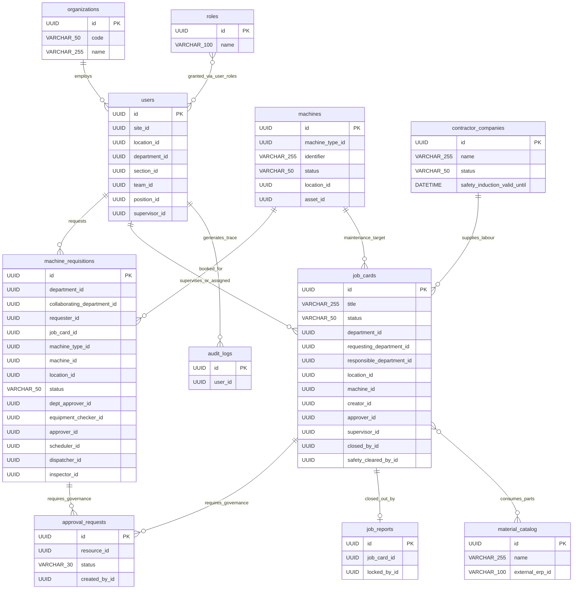
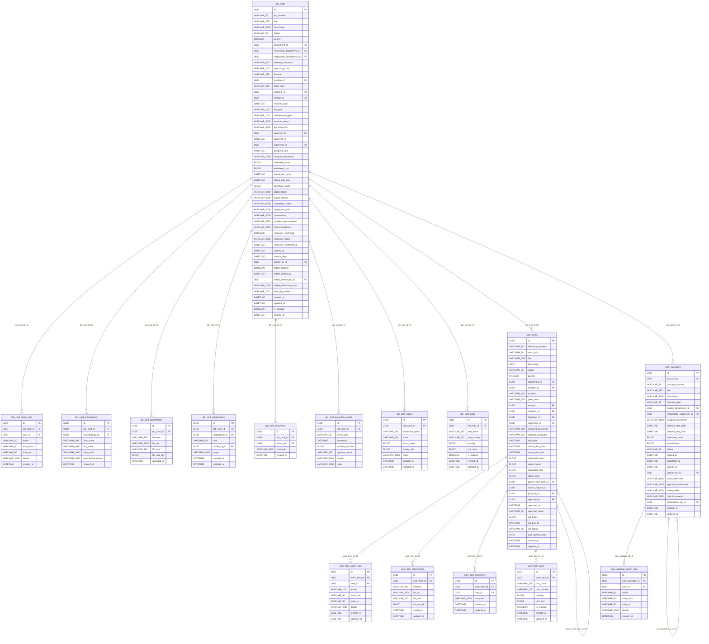
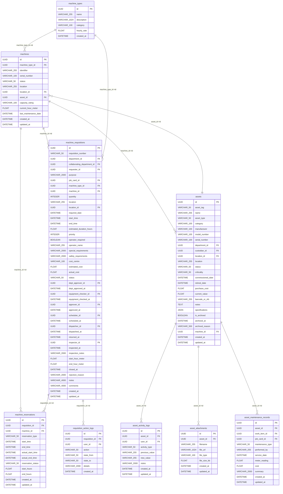
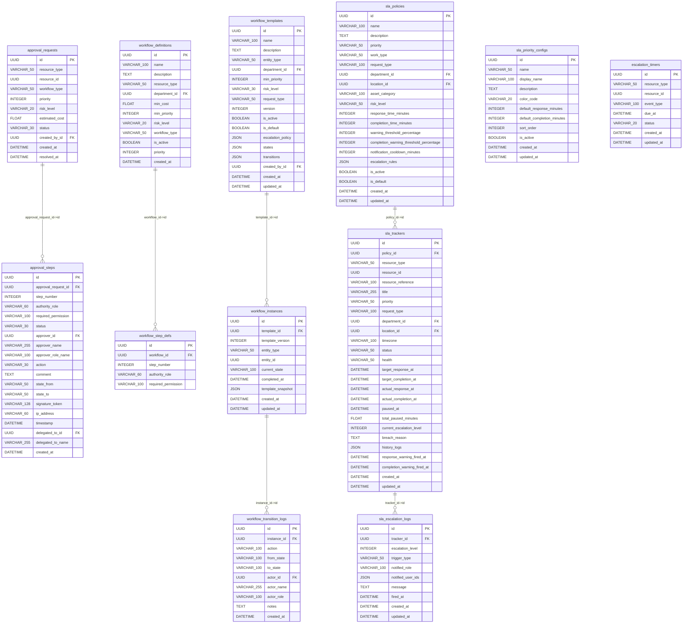
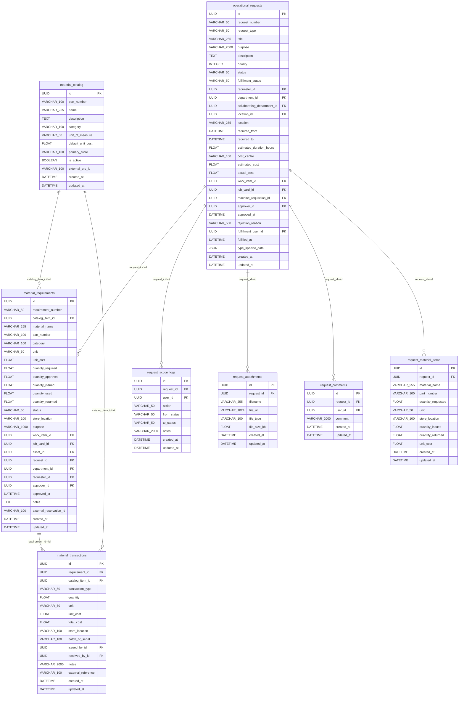
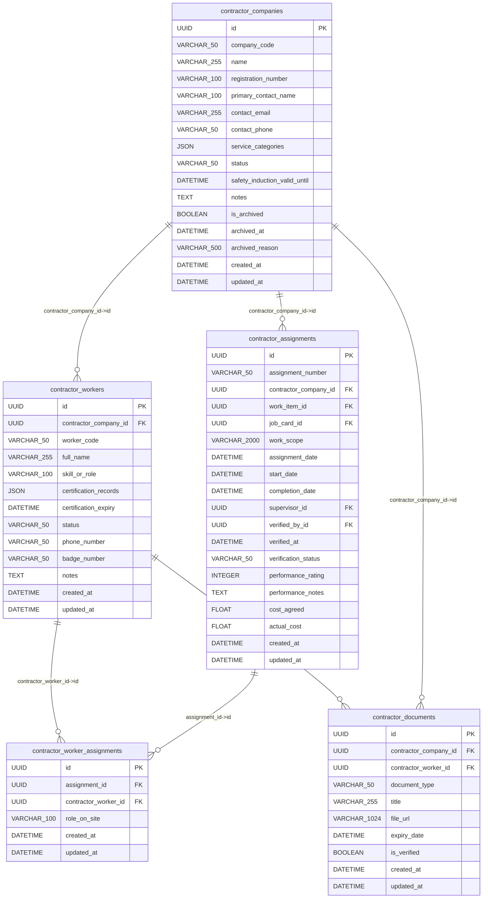

# Bikita Minerals DWRMS Database ERD Documentation

> **Database**: SQLite 3 (`backend/test_dwrms.db`)  
> **Total Tables**: 74  
> **Total Foreign Keys**: 162  
> **Total Live Records**: 9,172  
> **Interactive Explorer**: [`docs/database_erd_explorer.html`](file:///home/sila/Projects/jbc/docs/database_erd_explorer.html)  

## Executive Summary

The Bikita Minerals Digital Work Request & Resource Management System (DWRMS) database powers enterprise asset tracking, maintenance workflows, multi-tier approval governance, material requisition, and immutable audit logging. To maintain clarity across 74 tables and 162 foreign keys, this documentation is structured into **7 domain-specific ERDs** and a **High-Level Subject-Area Overview**.

### Domain Breakdown

| Domain | Tables | Key Focus |
|---|:---:|---|
| **Identity & RBAC** | 13 | Core operational schema for identity & rbac |
| **Work Orders & Maintenance** | 16 | Core operational schema for work orders & maintenance |
| **Fleet & Asset Operations** | 9 | Core operational schema for fleet & asset operations |
| **Approvals & Governance** | 12 | Core operational schema for approvals & governance |
| **Materials & Inventory** | 8 | Core operational schema for materials & inventory |
| **Contractors** | 5 | Core operational schema for contractors |
| **Closeout & Observability** | 11 | Core operational schema for closeout & observability |

---

## 0. High-Level Subject-Area Overview

This high-level ERD shows the core entity hubs that connect the discrete operational domains.

---

## 1. Domain: Work Orders & Maintenance

This domain encompasses **16 tables** managing work orders & maintenance.

### Work Orders & Maintenance Table Specifications

#### Table: `job_cards` (11 records)

| Column | Type | Constraints | Default | Notes |
|---|---|:---:|---|---|
| `id` | `UUID` | **PK**, NOT NULL | - | - |
| `job_number` | `VARCHAR(50)` | Nullable | - | - |
| `title` | `VARCHAR(255)` | NOT NULL | - | - |
| `description` | `VARCHAR(4000)` | Nullable | - | - |
| `status` | `VARCHAR(50)` | NOT NULL | - | - |
| `priority` | `INTEGER` | NOT NULL | - | - |
| `department_id` | `UUID` | NOT NULL, **FK** (`departments.id`) | - | - |
| `requesting_department_id` | `UUID` | **FK** (`departments.id`) | - | - |
| `responsible_department_id` | `UUID` | **FK** (`departments.id`) | - | - |
| `external_contractor` | `VARCHAR(500)` | Nullable | - | - |
| `workshop_code` | `VARCHAR(100)` | Nullable | - | - |
| `location` | `VARCHAR(255)` | Nullable | - | - |
| `location_id` | `UUID` | **FK** (`locations.id`) | - | - |
| `plant_area` | `VARCHAR(255)` | Nullable | - | - |
| `machine_id` | `UUID` | **FK** (`machines.id`) | - | - |
| `creator_id` | `UUID` | NOT NULL, **FK** (`users.id`) | - | - |
| `required_date` | `DATETIME` | Nullable | - | - |
| `job_type` | `VARCHAR(100)` | Nullable | - | - |
| `maintenance_type` | `VARCHAR(100)` | Nullable | - | - |
| `reported_issue` | `VARCHAR(4000)` | Nullable | - | - |
| `job_instruction` | `VARCHAR(4000)` | Nullable | - | - |
| `approver_id` | `UUID` | **FK** (`users.id`) | - | - |
| `approved_at` | `DATETIME` | Nullable | - | - |
| `supervisor_id` | `UUID` | **FK** (`users.id`) | - | - |
| `assigned_date` | `DATETIME` | Nullable | - | - |
| `assigned_personnel` | `VARCHAR(1000)` | Nullable | - | - |
| `estimated_hours` | `FLOAT` | NOT NULL | - | - |
| `estimated_cost` | `FLOAT` | NOT NULL | - | - |
| `actual_start_time` | `DATETIME` | Nullable | - | - |
| `actual_end_time` | `DATETIME` | Nullable | - | - |
| `downtime_hours` | `FLOAT` | NOT NULL | - | - |
| `action_taken` | `VARCHAR(4000)` | Nullable | - | - |
| `labour_details` | `VARCHAR(2000)` | Nullable | - | - |
| `completion_notes` | `VARCHAR(4000)` | Nullable | - | - |
| `equipment_used` | `VARCHAR(2000)` | Nullable | - | - |
| `observations` | `VARCHAR(4000)` | Nullable | - | - |
| `problems_encountered` | `VARCHAR(4000)` | Nullable | - | - |
| `recommendations` | `VARCHAR(4000)` | Nullable | - | - |
| `requester_confirmed` | `BOOLEAN` | NOT NULL | - | - |
| `requester_notes` | `VARCHAR(2000)` | Nullable | - | - |
| `requester_confirmed_at` | `DATETIME` | Nullable | - | - |
| `verified_at` | `DATETIME` | Nullable | - | - |
| `closure_date` | `DATETIME` | Nullable | - | - |
| `closed_by_id` | `UUID` | **FK** (`users.id`) | - | - |
| `safety_cleared` | `BOOLEAN` | NOT NULL | - | - |
| `safety_cleared_at` | `DATETIME` | Nullable | - | - |
| `safety_cleared_by_id` | `UUID` | **FK** (`users.id`) | - | - |
| `safety_clearance_notes` | `VARCHAR(2000)` | Nullable | - | - |
| `loto_tag_number` | `VARCHAR(100)` | Nullable | - | - |
| `created_at` | `DATETIME` | NOT NULL | - | - |
| `updated_at` | `DATETIME` | NOT NULL | - | - |
| `is_deleted` | `BOOLEAN` | NOT NULL | - | - |
| `deleted_at` | `DATETIME` | Nullable | - | - |

**Foreign Key Constraints**:

| Local Column | Referenced Table | Referenced Column | On Delete | On Update |
|---|---|---|---|---|
| `safety_cleared_by_id` | `users` | `id` | `NO ACTION` | `NO ACTION` |
| `closed_by_id` | `users` | `id` | `NO ACTION` | `NO ACTION` |
| `supervisor_id` | `users` | `id` | `NO ACTION` | `NO ACTION` |
| `approver_id` | `users` | `id` | `NO ACTION` | `NO ACTION` |
| `creator_id` | `users` | `id` | `NO ACTION` | `NO ACTION` |
| `machine_id` | `machines` | `id` | `NO ACTION` | `NO ACTION` |
| `location_id` | `locations` | `id` | `NO ACTION` | `NO ACTION` |
| `responsible_department_id` | `departments` | `id` | `NO ACTION` | `NO ACTION` |
| `requesting_department_id` | `departments` | `id` | `NO ACTION` | `NO ACTION` |
| `department_id` | `departments` | `id` | `NO ACTION` | `NO ACTION` |

**Indexes**:

| Index Name | Unique | Indexed Columns |
|---|:---:|---|
| `ix_job_cards_location_id` | No | `location_id` |
| `sqlite_autoindex_job_cards_1` | Yes | `id` |

---

#### Table: `job_card_labour` (10 records)

| Column | Type | Constraints | Default | Notes |
|---|---|:---:|---|---|
| `id` | `UUID` | **PK**, NOT NULL | - | - |
| `job_card_id` | `UUID` | NOT NULL, **FK** (`job_cards.id`) | - | - |
| `technician_name` | `VARCHAR(255)` | NOT NULL | - | - |
| `trade` | `VARCHAR(100)` | NOT NULL | - | - |
| `hours_spent` | `FLOAT` | NOT NULL | - | - |
| `hourly_rate` | `FLOAT` | NOT NULL | - | - |
| `notes` | `VARCHAR(1000)` | Nullable | - | - |
| `created_at` | `DATETIME` | NOT NULL | - | - |
| `updated_at` | `DATETIME` | NOT NULL | - | - |

**Foreign Key Constraints**:

| Local Column | Referenced Table | Referenced Column | On Delete | On Update |
|---|---|---|---|---|
| `job_card_id` | `job_cards` | `id` | `NO ACTION` | `NO ACTION` |

**Indexes**:

| Index Name | Unique | Indexed Columns |
|---|:---:|---|
| `sqlite_autoindex_job_card_labour_1` | Yes | `id` |

---

#### Table: `job_card_parts` (0 records)

| Column | Type | Constraints | Default | Notes |
|---|---|:---:|---|---|
| `id` | `UUID` | **PK**, NOT NULL | - | - |
| `job_card_id` | `UUID` | NOT NULL, **FK** (`job_cards.id`) | - | - |
| `part_name` | `VARCHAR(255)` | NOT NULL | - | - |
| `part_number` | `VARCHAR(100)` | Nullable | - | - |
| `quantity` | `FLOAT` | NOT NULL | - | - |
| `unit_cost` | `FLOAT` | Nullable | - | - |
| `is_material` | `BOOLEAN` | NOT NULL | - | - |
| `created_at` | `DATETIME` | NOT NULL | - | - |
| `updated_at` | `DATETIME` | NOT NULL | - | - |

**Foreign Key Constraints**:

| Local Column | Referenced Table | Referenced Column | On Delete | On Update |
|---|---|---|---|---|
| `job_card_id` | `job_cards` | `id` | `NO ACTION` | `NO ACTION` |

**Indexes**:

| Index Name | Unique | Indexed Columns |
|---|:---:|---|
| `sqlite_autoindex_job_card_parts_1` | Yes | `id` |

---

#### Table: `job_card_collaborators` (0 records)

| Column | Type | Constraints | Default | Notes |
|---|---|:---:|---|---|
| `id` | `UUID` | **PK**, NOT NULL | - | - |
| `job_card_id` | `UUID` | NOT NULL, **FK** (`job_cards.id`) | - | - |
| `department_id` | `UUID` | NOT NULL, **FK** (`departments.id`) | - | - |
| `role` | `VARCHAR(50)` | NOT NULL | - | - |
| `added_by_id` | `UUID` | NOT NULL, **FK** (`users.id`) | - | - |
| `notes` | `VARCHAR(1000)` | Nullable | - | - |
| `created_at` | `DATETIME` | NOT NULL | - | - |
| `updated_at` | `DATETIME` | NOT NULL | - | - |

**Foreign Key Constraints**:

| Local Column | Referenced Table | Referenced Column | On Delete | On Update |
|---|---|---|---|---|
| `added_by_id` | `users` | `id` | `NO ACTION` | `NO ACTION` |
| `department_id` | `departments` | `id` | `NO ACTION` | `NO ACTION` |
| `job_card_id` | `job_cards` | `id` | `NO ACTION` | `NO ACTION` |

**Indexes**:

| Index Name | Unique | Indexed Columns |
|---|:---:|---|
| `sqlite_autoindex_job_card_collaborators_1` | Yes | `id` |

---

#### Table: `job_card_comments` (0 records)

| Column | Type | Constraints | Default | Notes |
|---|---|:---:|---|---|
| `id` | `UUID` | **PK**, NOT NULL | - | - |
| `job_card_id` | `UUID` | NOT NULL, **FK** (`job_cards.id`) | - | - |
| `author_id` | `UUID` | NOT NULL, **FK** (`users.id`) | - | - |
| `comment` | `VARCHAR(4000)` | NOT NULL | - | - |
| `created_at` | `DATETIME` | NOT NULL | `CURRENT_TIMESTAMP` | - |

**Foreign Key Constraints**:

| Local Column | Referenced Table | Referenced Column | On Delete | On Update |
|---|---|---|---|---|
| `author_id` | `users` | `id` | `NO ACTION` | `NO ACTION` |
| `job_card_id` | `job_cards` | `id` | `NO ACTION` | `NO ACTION` |

**Indexes**:

| Index Name | Unique | Indexed Columns |
|---|:---:|---|
| `sqlite_autoindex_job_card_comments_1` | Yes | `id` |

---

#### Table: `job_card_attachments` (0 records)

| Column | Type | Constraints | Default | Notes |
|---|---|:---:|---|---|
| `id` | `UUID` | **PK**, NOT NULL | - | - |
| `job_card_id` | `UUID` | NOT NULL, **FK** (`job_cards.id`) | - | - |
| `filename` | `VARCHAR(255)` | NOT NULL | - | - |
| `file_url` | `VARCHAR(1024)` | Nullable | - | - |
| `file_type` | `VARCHAR(100)` | Nullable | - | - |
| `file_size_kb` | `FLOAT` | Nullable | - | - |
| `uploaded_at` | `DATETIME` | NOT NULL | `CURRENT_TIMESTAMP` | - |

**Foreign Key Constraints**:

| Local Column | Referenced Table | Referenced Column | On Delete | On Update |
|---|---|---|---|---|
| `job_card_id` | `job_cards` | `id` | `NO ACTION` | `NO ACTION` |

**Indexes**:

| Index Name | Unique | Indexed Columns |
|---|:---:|---|
| `sqlite_autoindex_job_card_attachments_1` | Yes | `id` |

---

#### Table: `job_card_amendments` (0 records)

| Column | Type | Constraints | Default | Notes |
|---|---|:---:|---|---|
| `id` | `UUID` | **PK**, NOT NULL | - | - |
| `job_card_id` | `UUID` | NOT NULL, **FK** (`job_cards.id`) | - | - |
| `amended_by_id` | `UUID` | NOT NULL, **FK** (`users.id`) | - | - |
| `field_name` | `VARCHAR(100)` | NOT NULL | - | - |
| `old_value` | `VARCHAR(4000)` | Nullable | - | - |
| `new_value` | `VARCHAR(4000)` | Nullable | - | - |
| `amendment_reason` | `VARCHAR(2000)` | NOT NULL | - | - |
| `created_at` | `DATETIME` | NOT NULL | `CURRENT_TIMESTAMP` | - |

**Foreign Key Constraints**:

| Local Column | Referenced Table | Referenced Column | On Delete | On Update |
|---|---|---|---|---|
| `amended_by_id` | `users` | `id` | `NO ACTION` | `NO ACTION` |
| `job_card_id` | `job_cards` | `id` | `NO ACTION` | `NO ACTION` |

**Indexes**:

| Index Name | Unique | Indexed Columns |
|---|:---:|---|
| `sqlite_autoindex_job_card_amendments_1` | Yes | `id` |

---

#### Table: `job_card_execution_events` (1 records)

| Column | Type | Constraints | Default | Notes |
|---|---|:---:|---|---|
| `id` | `UUID` | **PK**, NOT NULL | - | - |
| `job_card_id` | `UUID` | NOT NULL, **FK** (`job_cards.id`) | - | - |
| `event_type` | `VARCHAR(50)` | NOT NULL | - | - |
| `timestamp` | `DATETIME` | NOT NULL | - | - |
| `duration_minutes` | `FLOAT` | NOT NULL | - | - |
| `operator_name` | `VARCHAR(255)` | Nullable | - | - |
| `reason` | `VARCHAR(1000)` | Nullable | - | - |
| `notes` | `VARCHAR(2000)` | Nullable | - | - |

**Foreign Key Constraints**:

| Local Column | Referenced Table | Referenced Column | On Delete | On Update |
|---|---|---|---|---|
| `job_card_id` | `job_cards` | `id` | `NO ACTION` | `NO ACTION` |

**Indexes**:

| Index Name | Unique | Indexed Columns |
|---|:---:|---|
| `sqlite_autoindex_job_card_execution_events_1` | Yes | `id` |

---

#### Table: `job_card_action_logs` (1 records)

| Column | Type | Constraints | Default | Notes |
|---|---|:---:|---|---|
| `id` | `UUID` | **PK**, NOT NULL | - | - |
| `job_card_id` | `UUID` | NOT NULL, **FK** (`job_cards.id`) | - | - |
| `user_id` | `UUID` | NOT NULL, **FK** (`users.id`) | - | - |
| `action` | `VARCHAR(50)` | NOT NULL | - | - |
| `state_from` | `VARCHAR(50)` | Nullable | - | - |
| `state_to` | `VARCHAR(50)` | Nullable | - | - |
| `details` | `VARCHAR(2000)` | Nullable | - | - |
| `created_at` | `DATETIME` | NOT NULL | `CURRENT_TIMESTAMP` | - |

**Foreign Key Constraints**:

| Local Column | Referenced Table | Referenced Column | On Delete | On Update |
|---|---|---|---|---|
| `user_id` | `users` | `id` | `NO ACTION` | `NO ACTION` |
| `job_card_id` | `job_cards` | `id` | `NO ACTION` | `NO ACTION` |

**Indexes**:

| Index Name | Unique | Indexed Columns |
|---|:---:|---|
| `sqlite_autoindex_job_card_action_logs_1` | Yes | `id` |

---

#### Table: `work_items` (11 records)

| Column | Type | Constraints | Default | Notes |
|---|---|:---:|---|---|
| `id` | `UUID` | **PK**, NOT NULL | - | - |
| `reference_number` | `VARCHAR(50)` | NOT NULL | - | - |
| `work_type` | `VARCHAR(50)` | NOT NULL | - | - |
| `title` | `VARCHAR(255)` | NOT NULL | - | - |
| `description` | `TEXT` | Nullable | - | - |
| `status` | `VARCHAR(50)` | NOT NULL | - | - |
| `priority` | `INTEGER` | NOT NULL | - | - |
| `department_id` | `UUID` | NOT NULL, **FK** (`departments.id`) | - | - |
| `location_id` | `UUID` | **FK** (`locations.id`) | - | - |
| `location` | `VARCHAR(255)` | Nullable | - | - |
| `plant_area` | `VARCHAR(255)` | Nullable | - | - |
| `asset_id` | `UUID` | **FK** (`assets.id`) | - | - |
| `machine_id` | `UUID` | **FK** (`machines.id`) | - | - |
| `requester_id` | `UUID` | NOT NULL, **FK** (`users.id`) | - | - |
| `supervisor_id` | `UUID` | **FK** (`users.id`) | - | - |
| `assigned_personnel` | `VARCHAR(500)` | Nullable | - | - |
| `external_contractor` | `VARCHAR(255)` | Nullable | - | - |
| `due_date` | `DATETIME` | Nullable | - | - |
| `actual_start_time` | `DATETIME` | Nullable | - | - |
| `actual_end_time` | `DATETIME` | Nullable | - | - |
| `estimated_hours` | `FLOAT` | NOT NULL | - | - |
| `actual_hours` | `FLOAT` | NOT NULL | - | - |
| `estimated_cost` | `FLOAT` | NOT NULL | - | - |
| `actual_cost` | `FLOAT` | NOT NULL | - | - |
| `parent_work_item_id` | `UUID` | **FK** (`work_items.id`) | - | - |
| `source_request_id` | `UUID` | Nullable | - | - |
| `job_card_id` | `UUID` | **FK** (`job_cards.id`) | - | - |
| `approver_id` | `UUID` | **FK** (`users.id`) | - | - |
| `approved_at` | `DATETIME` | Nullable | - | - |
| `approval_status` | `VARCHAR(50)` | NOT NULL | - | - |
| `sla_hours` | `FLOAT` | NOT NULL | - | - |
| `sla_due_at` | `DATETIME` | Nullable | - | - |
| `sla_status` | `VARCHAR(50)` | NOT NULL | - | - |
| `type_specific_data` | `JSON` | Nullable | - | - |
| `created_at` | `DATETIME` | NOT NULL | - | - |
| `updated_at` | `DATETIME` | NOT NULL | - | - |

**Foreign Key Constraints**:

| Local Column | Referenced Table | Referenced Column | On Delete | On Update |
|---|---|---|---|---|
| `approver_id` | `users` | `id` | `NO ACTION` | `NO ACTION` |
| `job_card_id` | `job_cards` | `id` | `NO ACTION` | `NO ACTION` |
| `parent_work_item_id` | `work_items` | `id` | `NO ACTION` | `NO ACTION` |
| `supervisor_id` | `users` | `id` | `NO ACTION` | `NO ACTION` |
| `requester_id` | `users` | `id` | `NO ACTION` | `NO ACTION` |
| `machine_id` | `machines` | `id` | `NO ACTION` | `NO ACTION` |
| `asset_id` | `assets` | `id` | `NO ACTION` | `NO ACTION` |
| `location_id` | `locations` | `id` | `NO ACTION` | `NO ACTION` |
| `department_id` | `departments` | `id` | `NO ACTION` | `NO ACTION` |

**Indexes**:

| Index Name | Unique | Indexed Columns |
|---|:---:|---|
| `ix_work_items_supervisor_id` | No | `supervisor_id` |
| `ix_work_items_asset_id` | No | `asset_id` |
| `ix_work_items_title` | No | `title` |
| `ix_work_items_work_type` | No | `work_type` |
| `ix_work_items_job_card_id` | No | `job_card_id` |
| `ix_work_items_requester_id` | No | `requester_id` |
| `ix_work_items_location_id` | No | `location_id` |
| `ix_work_items_priority` | No | `priority` |
| `ix_work_items_status` | No | `status` |
| `ix_work_items_parent_work_item_id` | No | `parent_work_item_id` |
| `ix_work_items_machine_id` | No | `machine_id` |
| `ix_work_items_department_id` | No | `department_id` |
| `ix_work_items_reference_number` | Yes | `reference_number` |
| `sqlite_autoindex_work_items_1` | Yes | `id` |

---

#### Table: `work_item_parts` (0 records)

| Column | Type | Constraints | Default | Notes |
|---|---|:---:|---|---|
| `id` | `UUID` | **PK**, NOT NULL | - | - |
| `work_item_id` | `UUID` | NOT NULL, **FK** (`work_items.id`) | - | - |
| `part_name` | `VARCHAR(255)` | NOT NULL | - | - |
| `part_number` | `VARCHAR(100)` | Nullable | - | - |
| `quantity` | `FLOAT` | NOT NULL | - | - |
| `unit_cost` | `FLOAT` | Nullable | - | - |
| `is_material` | `BOOLEAN` | NOT NULL | - | - |
| `created_at` | `DATETIME` | NOT NULL | - | - |
| `updated_at` | `DATETIME` | NOT NULL | - | - |

**Foreign Key Constraints**:

| Local Column | Referenced Table | Referenced Column | On Delete | On Update |
|---|---|---|---|---|
| `work_item_id` | `work_items` | `id` | `NO ACTION` | `NO ACTION` |

**Indexes**:

| Index Name | Unique | Indexed Columns |
|---|:---:|---|
| `ix_work_item_parts_work_item_id` | No | `work_item_id` |
| `sqlite_autoindex_work_item_parts_1` | Yes | `id` |

---

#### Table: `work_item_comments` (0 records)

| Column | Type | Constraints | Default | Notes |
|---|---|:---:|---|---|
| `id` | `UUID` | **PK**, NOT NULL | - | - |
| `work_item_id` | `UUID` | NOT NULL, **FK** (`work_items.id`) | - | - |
| `user_id` | `UUID` | NOT NULL, **FK** (`users.id`) | - | - |
| `comment` | `VARCHAR(2000)` | NOT NULL | - | - |
| `created_at` | `DATETIME` | NOT NULL | - | - |
| `updated_at` | `DATETIME` | NOT NULL | - | - |

**Foreign Key Constraints**:

| Local Column | Referenced Table | Referenced Column | On Delete | On Update |
|---|---|---|---|---|
| `user_id` | `users` | `id` | `NO ACTION` | `NO ACTION` |
| `work_item_id` | `work_items` | `id` | `NO ACTION` | `NO ACTION` |

**Indexes**:

| Index Name | Unique | Indexed Columns |
|---|:---:|---|
| `ix_work_item_comments_work_item_id` | No | `work_item_id` |
| `sqlite_autoindex_work_item_comments_1` | Yes | `id` |

---

#### Table: `work_item_attachments` (0 records)

| Column | Type | Constraints | Default | Notes |
|---|---|:---:|---|---|
| `id` | `UUID` | **PK**, NOT NULL | - | - |
| `work_item_id` | `UUID` | NOT NULL, **FK** (`work_items.id`) | - | - |
| `filename` | `VARCHAR(255)` | NOT NULL | - | - |
| `file_url` | `VARCHAR(1024)` | Nullable | - | - |
| `file_type` | `VARCHAR(100)` | Nullable | - | - |
| `file_size_kb` | `FLOAT` | NOT NULL | - | - |
| `created_at` | `DATETIME` | NOT NULL | - | - |
| `updated_at` | `DATETIME` | NOT NULL | - | - |

**Foreign Key Constraints**:

| Local Column | Referenced Table | Referenced Column | On Delete | On Update |
|---|---|---|---|---|
| `work_item_id` | `work_items` | `id` | `NO ACTION` | `NO ACTION` |

**Indexes**:

| Index Name | Unique | Indexed Columns |
|---|:---:|---|
| `ix_work_item_attachments_work_item_id` | No | `work_item_id` |
| `sqlite_autoindex_work_item_attachments_1` | Yes | `id` |

---

#### Table: `work_item_action_logs` (0 records)

| Column | Type | Constraints | Default | Notes |
|---|---|:---:|---|---|
| `id` | `UUID` | **PK**, NOT NULL | - | - |
| `work_item_id` | `UUID` | NOT NULL, **FK** (`work_items.id`) | - | - |
| `user_id` | `UUID` | NOT NULL, **FK** (`users.id`) | - | - |
| `action` | `VARCHAR(100)` | NOT NULL | - | - |
| `state_from` | `VARCHAR(50)` | Nullable | - | - |
| `state_to` | `VARCHAR(50)` | Nullable | - | - |
| `details` | `VARCHAR(2000)` | Nullable | - | - |
| `created_at` | `DATETIME` | NOT NULL | - | - |
| `updated_at` | `DATETIME` | NOT NULL | - | - |

**Foreign Key Constraints**:

| Local Column | Referenced Table | Referenced Column | On Delete | On Update |
|---|---|---|---|---|
| `user_id` | `users` | `id` | `NO ACTION` | `NO ACTION` |
| `work_item_id` | `work_items` | `id` | `NO ACTION` | `NO ACTION` |

**Indexes**:

| Index Name | Unique | Indexed Columns |
|---|:---:|---|
| `ix_work_item_action_logs_work_item_id` | No | `work_item_id` |
| `sqlite_autoindex_work_item_action_logs_1` | Yes | `id` |

---

#### Table: `work_packages` (0 records)

| Column | Type | Constraints | Default | Notes |
|---|---|:---:|---|---|
| `id` | `UUID` | **PK**, NOT NULL | - | - |
| `job_card_id` | `UUID` | NOT NULL, **FK** (`job_cards.id`) | - | - |
| `package_number` | `VARCHAR(20)` | NOT NULL | - | - |
| `title` | `VARCHAR(255)` | NOT NULL | - | - |
| `description` | `VARCHAR(4000)` | Nullable | - | - |
| `package_type` | `VARCHAR(50)` | NOT NULL | - | - |
| `owning_department_id` | `UUID` | NOT NULL, **FK** (`departments.id`) | - | - |
| `responsible_supervisor_id` | `UUID` | **FK** (`users.id`) | - | - |
| `assigned_personnel` | `VARCHAR(1000)` | Nullable | - | - |
| `planned_start_date` | `DATETIME` | Nullable | - | - |
| `planned_end_date` | `DATETIME` | Nullable | - | - |
| `estimated_hours` | `FLOAT` | NOT NULL | - | - |
| `actual_hours` | `FLOAT` | NOT NULL | - | - |
| `status` | `VARCHAR(50)` | NOT NULL | - | - |
| `started_at` | `DATETIME` | Nullable | - | - |
| `completed_at` | `DATETIME` | Nullable | - | - |
| `verified_at` | `DATETIME` | Nullable | - | - |
| `verified_by_id` | `UUID` | **FK** (`users.id`) | - | - |
| `work_performed` | `VARCHAR(4000)` | Nullable | - | - |
| `special_requirements` | `VARCHAR(2000)` | Nullable | - | - |
| `safety_notes` | `VARCHAR(2000)` | Nullable | - | - |
| `rejection_reason` | `VARCHAR(2000)` | Nullable | - | - |
| `prerequisite_wp_id` | `UUID` | **FK** (`work_packages.id`) | - | - |
| `created_at` | `DATETIME` | NOT NULL | - | - |
| `updated_at` | `DATETIME` | NOT NULL | - | - |

**Foreign Key Constraints**:

| Local Column | Referenced Table | Referenced Column | On Delete | On Update |
|---|---|---|---|---|
| `prerequisite_wp_id` | `work_packages` | `id` | `NO ACTION` | `NO ACTION` |
| `verified_by_id` | `users` | `id` | `NO ACTION` | `NO ACTION` |
| `responsible_supervisor_id` | `users` | `id` | `NO ACTION` | `NO ACTION` |
| `owning_department_id` | `departments` | `id` | `NO ACTION` | `NO ACTION` |
| `job_card_id` | `job_cards` | `id` | `NO ACTION` | `NO ACTION` |

**Indexes**:

| Index Name | Unique | Indexed Columns |
|---|:---:|---|
| `sqlite_autoindex_work_packages_1` | Yes | `id` |

---

#### Table: `work_package_action_logs` (0 records)

| Column | Type | Constraints | Default | Notes |
|---|---|:---:|---|---|
| `id` | `UUID` | **PK**, NOT NULL | - | - |
| `work_package_id` | `UUID` | NOT NULL, **FK** (`work_packages.id`) | - | - |
| `user_id` | `UUID` | NOT NULL, **FK** (`users.id`) | - | - |
| `action` | `VARCHAR(80)` | NOT NULL | - | - |
| `state_from` | `VARCHAR(50)` | Nullable | - | - |
| `state_to` | `VARCHAR(50)` | Nullable | - | - |
| `details` | `VARCHAR(2000)` | Nullable | - | - |
| `created_at` | `DATETIME` | NOT NULL | `CURRENT_TIMESTAMP` | - |

**Foreign Key Constraints**:

| Local Column | Referenced Table | Referenced Column | On Delete | On Update |
|---|---|---|---|---|
| `user_id` | `users` | `id` | `NO ACTION` | `NO ACTION` |
| `work_package_id` | `work_packages` | `id` | `NO ACTION` | `NO ACTION` |

**Indexes**:

| Index Name | Unique | Indexed Columns |
|---|:---:|---|
| `sqlite_autoindex_work_package_action_logs_1` | Yes | `id` |

---

## 2. Domain: Fleet & Asset Operations

This domain encompasses **9 tables** managing fleet & asset operations.

### Fleet & Asset Operations Table Specifications

#### Table: `machines` (26 records)

| Column | Type | Constraints | Default | Notes |
|---|---|:---:|---|---|
| `id` | `UUID` | **PK**, NOT NULL | - | - |
| `machine_type_id` | `UUID` | NOT NULL, **FK** (`machine_types.id`) | - | - |
| `identifier` | `VARCHAR(255)` | NOT NULL | - | - |
| `serial_number` | `VARCHAR(100)` | Nullable | - | - |
| `status` | `VARCHAR(50)` | NOT NULL | - | - |
| `location` | `VARCHAR(255)` | Nullable | - | - |
| `location_id` | `UUID` | **FK** (`locations.id`) | - | - |
| `asset_id` | `UUID` | **FK** (`assets.id`) | - | - |
| `capacity_rating` | `VARCHAR(100)` | Nullable | - | - |
| `current_hour_meter` | `FLOAT` | NOT NULL | - | - |
| `last_maintenance_date` | `DATETIME` | Nullable | - | - |
| `created_at` | `DATETIME` | NOT NULL | `CURRENT_TIMESTAMP` | - |
| `updated_at` | `DATETIME` | NOT NULL | `CURRENT_TIMESTAMP` | - |

**Foreign Key Constraints**:

| Local Column | Referenced Table | Referenced Column | On Delete | On Update |
|---|---|---|---|---|
| `asset_id` | `assets` | `id` | `NO ACTION` | `NO ACTION` |
| `location_id` | `locations` | `id` | `NO ACTION` | `NO ACTION` |
| `machine_type_id` | `machine_types` | `id` | `NO ACTION` | `NO ACTION` |

**Indexes**:

| Index Name | Unique | Indexed Columns |
|---|:---:|---|
| `ix_machines_location_id` | No | `location_id` |
| `ix_machines_asset_id` | No | `asset_id` |
| `sqlite_autoindex_machines_2` | Yes | `identifier` |
| `sqlite_autoindex_machines_1` | Yes | `id` |

---

#### Table: `machine_types` (9 records)

| Column | Type | Constraints | Default | Notes |
|---|---|:---:|---|---|
| `id` | `UUID` | **PK**, NOT NULL | - | - |
| `name` | `VARCHAR(255)` | NOT NULL | - | - |
| `description` | `VARCHAR(1024)` | Nullable | - | - |
| `category` | `VARCHAR(100)` | Nullable | - | - |
| `hourly_rate` | `FLOAT` | NOT NULL | - | - |
| `created_at` | `DATETIME` | NOT NULL | `CURRENT_TIMESTAMP` | - |

**Indexes**:

| Index Name | Unique | Indexed Columns |
|---|:---:|---|
| `sqlite_autoindex_machine_types_2` | Yes | `name` |
| `sqlite_autoindex_machine_types_1` | Yes | `id` |

---

#### Table: `machine_requisitions` (6 records)

| Column | Type | Constraints | Default | Notes |
|---|---|:---:|---|---|
| `id` | `UUID` | **PK**, NOT NULL | - | - |
| `requisition_number` | `VARCHAR(50)` | Nullable | - | - |
| `department_id` | `UUID` | NOT NULL, **FK** (`departments.id`) | - | - |
| `collaborating_department_id` | `UUID` | **FK** (`departments.id`) | - | - |
| `requester_id` | `UUID` | NOT NULL, **FK** (`users.id`) | - | - |
| `purpose` | `VARCHAR(2000)` | NOT NULL | - | - |
| `job_card_id` | `UUID` | **FK** (`job_cards.id`) | - | - |
| `machine_type_id` | `UUID` | NOT NULL, **FK** (`machine_types.id`) | - | - |
| `machine_id` | `UUID` | **FK** (`machines.id`) | - | - |
| `quantity` | `INTEGER` | NOT NULL | - | - |
| `location` | `VARCHAR(255)` | NOT NULL | - | - |
| `location_id` | `UUID` | **FK** (`locations.id`) | - | - |
| `required_date` | `DATETIME` | Nullable | - | - |
| `start_time` | `DATETIME` | NOT NULL | - | - |
| `end_time` | `DATETIME` | NOT NULL | - | - |
| `estimated_duration_hours` | `FLOAT` | NOT NULL | - | - |
| `priority` | `INTEGER` | NOT NULL | - | - |
| `operator_required` | `BOOLEAN` | NOT NULL | - | - |
| `operator_name` | `VARCHAR(255)` | Nullable | - | - |
| `special_requirements` | `VARCHAR(2000)` | Nullable | - | - |
| `safety_requirements` | `VARCHAR(2000)` | Nullable | - | - |
| `cost_centre` | `VARCHAR(100)` | Nullable | - | - |
| `estimated_cost` | `FLOAT` | NOT NULL | - | - |
| `actual_cost` | `FLOAT` | Nullable | - | - |
| `status` | `VARCHAR(50)` | NOT NULL | - | - |
| `dept_approver_id` | `UUID` | **FK** (`users.id`) | - | - |
| `dept_approved_at` | `DATETIME` | Nullable | - | - |
| `equipment_checker_id` | `UUID` | **FK** (`users.id`) | - | - |
| `equipment_checked_at` | `DATETIME` | Nullable | - | - |
| `approver_id` | `UUID` | **FK** (`users.id`) | - | - |
| `approved_at` | `DATETIME` | Nullable | - | - |
| `scheduler_id` | `UUID` | **FK** (`users.id`) | - | - |
| `scheduled_at` | `DATETIME` | Nullable | - | - |
| `dispatcher_id` | `UUID` | **FK** (`users.id`) | - | - |
| `dispatched_at` | `DATETIME` | Nullable | - | - |
| `returned_at` | `DATETIME` | Nullable | - | - |
| `inspector_id` | `UUID` | **FK** (`users.id`) | - | - |
| `inspected_at` | `DATETIME` | Nullable | - | - |
| `inspection_notes` | `VARCHAR(2000)` | Nullable | - | - |
| `start_hour_meter` | `FLOAT` | Nullable | - | - |
| `end_hour_meter` | `FLOAT` | Nullable | - | - |
| `closed_at` | `DATETIME` | Nullable | - | - |
| `rejection_reason` | `VARCHAR(2000)` | Nullable | - | - |
| `notes` | `VARCHAR(4000)` | Nullable | - | - |
| `comments` | `VARCHAR(4000)` | Nullable | - | - |
| `created_at` | `DATETIME` | NOT NULL | - | - |
| `updated_at` | `DATETIME` | NOT NULL | - | - |

**Foreign Key Constraints**:

| Local Column | Referenced Table | Referenced Column | On Delete | On Update |
|---|---|---|---|---|
| `inspector_id` | `users` | `id` | `NO ACTION` | `NO ACTION` |
| `dispatcher_id` | `users` | `id` | `NO ACTION` | `NO ACTION` |
| `scheduler_id` | `users` | `id` | `NO ACTION` | `NO ACTION` |
| `approver_id` | `users` | `id` | `NO ACTION` | `NO ACTION` |
| `equipment_checker_id` | `users` | `id` | `NO ACTION` | `NO ACTION` |
| `dept_approver_id` | `users` | `id` | `NO ACTION` | `NO ACTION` |
| `location_id` | `locations` | `id` | `NO ACTION` | `NO ACTION` |
| `machine_id` | `machines` | `id` | `NO ACTION` | `NO ACTION` |
| `machine_type_id` | `machine_types` | `id` | `NO ACTION` | `NO ACTION` |
| `job_card_id` | `job_cards` | `id` | `NO ACTION` | `NO ACTION` |
| `requester_id` | `users` | `id` | `NO ACTION` | `NO ACTION` |
| `collaborating_department_id` | `departments` | `id` | `NO ACTION` | `NO ACTION` |
| `department_id` | `departments` | `id` | `NO ACTION` | `NO ACTION` |

**Indexes**:

| Index Name | Unique | Indexed Columns |
|---|:---:|---|
| `ix_machine_requisitions_location_id` | No | `location_id` |
| `sqlite_autoindex_machine_requisitions_2` | Yes | `requisition_number` |
| `sqlite_autoindex_machine_requisitions_1` | Yes | `id` |

---

#### Table: `machine_reservations` (0 records)

| Column | Type | Constraints | Default | Notes |
|---|---|:---:|---|---|
| `id` | `UUID` | **PK**, NOT NULL | - | - |
| `requisition_id` | `UUID` | **FK** (`machine_requisitions.id`) | - | - |
| `machine_id` | `UUID` | NOT NULL, **FK** (`machines.id`) | - | - |
| `reservation_type` | `VARCHAR(50)` | NOT NULL | - | - |
| `start_time` | `DATETIME` | NOT NULL | - | - |
| `end_time` | `DATETIME` | NOT NULL | - | - |
| `actual_start_time` | `DATETIME` | Nullable | - | - |
| `actual_end_time` | `DATETIME` | Nullable | - | - |
| `reservation_status` | `VARCHAR(50)` | NOT NULL | - | - |
| `start_hours` | `FLOAT` | NOT NULL | - | - |
| `end_hours` | `FLOAT` | Nullable | - | - |
| `created_at` | `DATETIME` | NOT NULL | `CURRENT_TIMESTAMP` | - |
| `updated_at` | `DATETIME` | NOT NULL | `CURRENT_TIMESTAMP` | - |

**Foreign Key Constraints**:

| Local Column | Referenced Table | Referenced Column | On Delete | On Update |
|---|---|---|---|---|
| `machine_id` | `machines` | `id` | `NO ACTION` | `NO ACTION` |
| `requisition_id` | `machine_requisitions` | `id` | `NO ACTION` | `NO ACTION` |

**Indexes**:

| Index Name | Unique | Indexed Columns |
|---|:---:|---|
| `sqlite_autoindex_machine_reservations_1` | Yes | `id` |

---

#### Table: `requisition_action_logs` (0 records)

| Column | Type | Constraints | Default | Notes |
|---|---|:---:|---|---|
| `id` | `UUID` | **PK**, NOT NULL | - | - |
| `requisition_id` | `UUID` | NOT NULL, **FK** (`machine_requisitions.id`) | - | - |
| `user_id` | `UUID` | NOT NULL, **FK** (`users.id`) | - | - |
| `action` | `VARCHAR(50)` | NOT NULL | - | - |
| `state_from` | `VARCHAR(50)` | Nullable | - | - |
| `state_to` | `VARCHAR(50)` | Nullable | - | - |
| `details` | `VARCHAR(2000)` | Nullable | - | - |
| `created_at` | `DATETIME` | NOT NULL | `CURRENT_TIMESTAMP` | - |

**Foreign Key Constraints**:

| Local Column | Referenced Table | Referenced Column | On Delete | On Update |
|---|---|---|---|---|
| `user_id` | `users` | `id` | `NO ACTION` | `NO ACTION` |
| `requisition_id` | `machine_requisitions` | `id` | `NO ACTION` | `NO ACTION` |

**Indexes**:

| Index Name | Unique | Indexed Columns |
|---|:---:|---|
| `sqlite_autoindex_requisition_action_logs_1` | Yes | `id` |

---

#### Table: `assets` (9 records)

| Column | Type | Constraints | Default | Notes |
|---|---|:---:|---|---|
| `id` | `UUID` | **PK**, NOT NULL | - | - |
| `asset_tag` | `VARCHAR(50)` | NOT NULL | - | - |
| `name` | `VARCHAR(255)` | NOT NULL | - | - |
| `asset_type` | `VARCHAR(50)` | NOT NULL | - | - |
| `category` | `VARCHAR(100)` | Nullable | - | - |
| `manufacturer` | `VARCHAR(100)` | Nullable | - | - |
| `model_number` | `VARCHAR(100)` | Nullable | - | - |
| `serial_number` | `VARCHAR(100)` | Nullable | - | - |
| `department_id` | `UUID` | NOT NULL, **FK** (`departments.id`) | - | - |
| `custodian_id` | `UUID` | **FK** (`users.id`) | - | - |
| `location_id` | `UUID` | **FK** (`locations.id`) | - | - |
| `location` | `VARCHAR(255)` | Nullable | - | - |
| `status` | `VARCHAR(50)` | NOT NULL | - | - |
| `criticality` | `VARCHAR(50)` | NOT NULL | - | - |
| `commissioned_date` | `DATETIME` | Nullable | - | - |
| `retired_date` | `DATETIME` | Nullable | - | - |
| `purchase_cost` | `FLOAT` | Nullable | - | - |
| `current_value` | `FLOAT` | Nullable | - | - |
| `barcode_or_nfc` | `VARCHAR(255)` | Nullable | - | - |
| `notes` | `TEXT` | Nullable | - | - |
| `specifications` | `JSON` | Nullable | - | - |
| `is_archived` | `BOOLEAN` | NOT NULL | - | - |
| `archived_at` | `DATETIME` | Nullable | - | - |
| `archived_reason` | `VARCHAR(500)` | Nullable | - | - |
| `machine_id` | `UUID` | **FK** (`machines.id`) | - | - |
| `created_at` | `DATETIME` | NOT NULL | - | - |
| `updated_at` | `DATETIME` | NOT NULL | - | - |

**Foreign Key Constraints**:

| Local Column | Referenced Table | Referenced Column | On Delete | On Update |
|---|---|---|---|---|
| `machine_id` | `machines` | `id` | `NO ACTION` | `NO ACTION` |
| `location_id` | `locations` | `id` | `NO ACTION` | `NO ACTION` |
| `custodian_id` | `users` | `id` | `NO ACTION` | `NO ACTION` |
| `department_id` | `departments` | `id` | `NO ACTION` | `NO ACTION` |

**Indexes**:

| Index Name | Unique | Indexed Columns |
|---|:---:|---|
| `ix_assets_barcode_or_nfc` | No | `barcode_or_nfc` |
| `ix_assets_department_id` | No | `department_id` |
| `ix_assets_asset_tag` | Yes | `asset_tag` |
| `ix_assets_location_id` | No | `location_id` |
| `ix_assets_custodian_id` | No | `custodian_id` |
| `ix_assets_asset_type` | No | `asset_type` |
| `ix_assets_name` | No | `name` |
| `ix_assets_machine_id` | No | `machine_id` |
| `ix_assets_status` | No | `status` |
| `ix_assets_serial_number` | No | `serial_number` |
| `ix_assets_category` | No | `category` |
| `sqlite_autoindex_assets_1` | Yes | `id` |

---

#### Table: `asset_maintenance_records` (0 records)

| Column | Type | Constraints | Default | Notes |
|---|---|:---:|---|---|
| `id` | `UUID` | **PK**, NOT NULL | - | - |
| `asset_id` | `UUID` | NOT NULL, **FK** (`assets.id`) | - | - |
| `work_item_id` | `UUID` | **FK** (`work_items.id`) | - | - |
| `job_card_id` | `UUID` | **FK** (`job_cards.id`) | - | - |
| `maintenance_type` | `VARCHAR(50)` | NOT NULL | - | - |
| `performed_by` | `VARCHAR(255)` | Nullable | - | - |
| `service_date` | `DATETIME` | NOT NULL | - | - |
| `meter_reading` | `FLOAT` | Nullable | - | - |
| `cost` | `FLOAT` | NOT NULL | - | - |
| `summary` | `VARCHAR(2000)` | NOT NULL | - | - |
| `created_at` | `DATETIME` | NOT NULL | - | - |
| `updated_at` | `DATETIME` | NOT NULL | - | - |

**Foreign Key Constraints**:

| Local Column | Referenced Table | Referenced Column | On Delete | On Update |
|---|---|---|---|---|
| `job_card_id` | `job_cards` | `id` | `NO ACTION` | `NO ACTION` |
| `work_item_id` | `work_items` | `id` | `NO ACTION` | `NO ACTION` |
| `asset_id` | `assets` | `id` | `NO ACTION` | `NO ACTION` |

**Indexes**:

| Index Name | Unique | Indexed Columns |
|---|:---:|---|
| `ix_asset_maintenance_records_work_item_id` | No | `work_item_id` |
| `ix_asset_maintenance_records_job_card_id` | No | `job_card_id` |
| `ix_asset_maintenance_records_asset_id` | No | `asset_id` |
| `sqlite_autoindex_asset_maintenance_records_1` | Yes | `id` |

---

#### Table: `asset_activity_logs` (0 records)

| Column | Type | Constraints | Default | Notes |
|---|---|:---:|---|---|
| `id` | `UUID` | **PK**, NOT NULL | - | - |
| `asset_id` | `UUID` | NOT NULL, **FK** (`assets.id`) | - | - |
| `user_id` | `UUID` | NOT NULL, **FK** (`users.id`) | - | - |
| `activity_type` | `VARCHAR(50)` | NOT NULL | - | - |
| `previous_value` | `VARCHAR(255)` | Nullable | - | - |
| `new_value` | `VARCHAR(255)` | Nullable | - | - |
| `notes` | `VARCHAR(2000)` | Nullable | - | - |
| `created_at` | `DATETIME` | NOT NULL | - | - |
| `updated_at` | `DATETIME` | NOT NULL | - | - |

**Foreign Key Constraints**:

| Local Column | Referenced Table | Referenced Column | On Delete | On Update |
|---|---|---|---|---|
| `user_id` | `users` | `id` | `NO ACTION` | `NO ACTION` |
| `asset_id` | `assets` | `id` | `NO ACTION` | `NO ACTION` |

**Indexes**:

| Index Name | Unique | Indexed Columns |
|---|:---:|---|
| `ix_asset_activity_logs_asset_id` | No | `asset_id` |
| `sqlite_autoindex_asset_activity_logs_1` | Yes | `id` |

---

#### Table: `asset_attachments` (0 records)

| Column | Type | Constraints | Default | Notes |
|---|---|:---:|---|---|
| `id` | `UUID` | **PK**, NOT NULL | - | - |
| `asset_id` | `UUID` | NOT NULL, **FK** (`assets.id`) | - | - |
| `filename` | `VARCHAR(255)` | NOT NULL | - | - |
| `file_url` | `VARCHAR(1024)` | Nullable | - | - |
| `file_type` | `VARCHAR(100)` | Nullable | - | - |
| `file_size_kb` | `FLOAT` | NOT NULL | - | - |
| `created_at` | `DATETIME` | NOT NULL | - | - |
| `updated_at` | `DATETIME` | NOT NULL | - | - |

**Foreign Key Constraints**:

| Local Column | Referenced Table | Referenced Column | On Delete | On Update |
|---|---|---|---|---|
| `asset_id` | `assets` | `id` | `NO ACTION` | `NO ACTION` |

**Indexes**:

| Index Name | Unique | Indexed Columns |
|---|:---:|---|
| `ix_asset_attachments_asset_id` | No | `asset_id` |
| `sqlite_autoindex_asset_attachments_1` | Yes | `id` |

---

## 3. Domain: Approvals & Governance

This domain encompasses **12 tables** managing approvals & governance.

### Approvals & Governance Table Specifications

#### Table: `approval_requests` (7 records)

| Column | Type | Constraints | Default | Notes |
|---|---|:---:|---|---|
| `id` | `UUID` | **PK**, NOT NULL | - | - |
| `resource_type` | `VARCHAR(50)` | NOT NULL | - | - |
| `resource_id` | `UUID` | NOT NULL | - | - |
| `workflow_type` | `VARCHAR(50)` | NOT NULL | - | - |
| `priority` | `INTEGER` | NOT NULL | - | - |
| `risk_level` | `VARCHAR(20)` | NOT NULL | - | - |
| `estimated_cost` | `FLOAT` | NOT NULL | - | - |
| `status` | `VARCHAR(30)` | NOT NULL | - | - |
| `created_by_id` | `UUID` | NOT NULL, **FK** (`users.id`) | - | - |
| `created_at` | `DATETIME` | NOT NULL | `CURRENT_TIMESTAMP` | - |
| `resolved_at` | `DATETIME` | Nullable | - | - |

**Foreign Key Constraints**:

| Local Column | Referenced Table | Referenced Column | On Delete | On Update |
|---|---|---|---|---|
| `created_by_id` | `users` | `id` | `NO ACTION` | `NO ACTION` |

**Indexes**:

| Index Name | Unique | Indexed Columns |
|---|:---:|---|
| `ix_approval_requests_resource_type` | No | `resource_type` |
| `ix_approval_requests_status` | No | `status` |
| `ix_approval_requests_resource_id` | No | `resource_id` |
| `sqlite_autoindex_approval_requests_1` | Yes | `id` |

---

#### Table: `approval_steps` (7 records)

| Column | Type | Constraints | Default | Notes |
|---|---|:---:|---|---|
| `id` | `UUID` | **PK**, NOT NULL | - | - |
| `approval_request_id` | `UUID` | NOT NULL, **FK** (`approval_requests.id`) | - | - |
| `step_number` | `INTEGER` | NOT NULL | - | - |
| `authority_role` | `VARCHAR(60)` | NOT NULL | - | - |
| `required_permission` | `VARCHAR(100)` | NOT NULL | - | - |
| `status` | `VARCHAR(30)` | NOT NULL | - | - |
| `approver_id` | `UUID` | **FK** (`users.id`) | - | - |
| `approver_name` | `VARCHAR(255)` | Nullable | - | - |
| `approver_role_name` | `VARCHAR(100)` | Nullable | - | - |
| `action` | `VARCHAR(30)` | Nullable | - | - |
| `comment` | `TEXT` | Nullable | - | - |
| `state_from` | `VARCHAR(50)` | Nullable | - | - |
| `state_to` | `VARCHAR(50)` | Nullable | - | - |
| `signature_token` | `VARCHAR(128)` | Nullable | - | - |
| `ip_address` | `VARCHAR(60)` | Nullable | - | - |
| `timestamp` | `DATETIME` | Nullable | - | - |
| `delegated_to_id` | `UUID` | **FK** (`users.id`) | - | - |
| `delegated_to_name` | `VARCHAR(255)` | Nullable | - | - |
| `created_at` | `DATETIME` | NOT NULL | `CURRENT_TIMESTAMP` | - |

**Foreign Key Constraints**:

| Local Column | Referenced Table | Referenced Column | On Delete | On Update |
|---|---|---|---|---|
| `delegated_to_id` | `users` | `id` | `NO ACTION` | `NO ACTION` |
| `approver_id` | `users` | `id` | `NO ACTION` | `NO ACTION` |
| `approval_request_id` | `approval_requests` | `id` | `NO ACTION` | `NO ACTION` |

**Indexes**:

| Index Name | Unique | Indexed Columns |
|---|:---:|---|
| `ix_approval_steps_approval_request_id` | No | `approval_request_id` |
| `sqlite_autoindex_approval_steps_1` | Yes | `id` |

---

#### Table: `workflow_definitions` (4 records)

| Column | Type | Constraints | Default | Notes |
|---|---|:---:|---|---|
| `id` | `UUID` | **PK**, NOT NULL | - | - |
| `name` | `VARCHAR(100)` | NOT NULL | - | - |
| `description` | `TEXT` | Nullable | - | - |
| `resource_type` | `VARCHAR(50)` | Nullable | - | - |
| `department_id` | `UUID` | **FK** (`departments.id`) | - | - |
| `min_cost` | `FLOAT` | Nullable | - | - |
| `min_priority` | `INTEGER` | Nullable | - | - |
| `risk_level` | `VARCHAR(20)` | Nullable | - | - |
| `workflow_type` | `VARCHAR(50)` | Nullable | - | - |
| `is_active` | `BOOLEAN` | NOT NULL | - | - |
| `priority` | `INTEGER` | NOT NULL | - | - |
| `created_at` | `DATETIME` | NOT NULL | `CURRENT_TIMESTAMP` | - |

**Foreign Key Constraints**:

| Local Column | Referenced Table | Referenced Column | On Delete | On Update |
|---|---|---|---|---|
| `department_id` | `departments` | `id` | `NO ACTION` | `NO ACTION` |

**Indexes**:

| Index Name | Unique | Indexed Columns |
|---|:---:|---|
| `ix_workflow_definitions_resource_type` | No | `resource_type` |
| `sqlite_autoindex_workflow_definitions_1` | Yes | `id` |

---

#### Table: `workflow_templates` (0 records)

| Column | Type | Constraints | Default | Notes |
|---|---|:---:|---|---|
| `id` | `UUID` | **PK**, NOT NULL | - | - |
| `name` | `VARCHAR(100)` | NOT NULL | - | - |
| `description` | `TEXT` | Nullable | - | - |
| `entity_type` | `VARCHAR(50)` | NOT NULL | - | - |
| `department_id` | `UUID` | **FK** (`departments.id`) | - | - |
| `min_priority` | `INTEGER` | Nullable | - | - |
| `risk_level` | `VARCHAR(30)` | Nullable | - | - |
| `request_type` | `VARCHAR(50)` | Nullable | - | - |
| `version` | `INTEGER` | NOT NULL | - | - |
| `is_active` | `BOOLEAN` | NOT NULL | - | - |
| `is_default` | `BOOLEAN` | NOT NULL | - | - |
| `escalation_policy` | `JSON` | Nullable | - | - |
| `states` | `JSON` | NOT NULL | - | - |
| `transitions` | `JSON` | NOT NULL | - | - |
| `created_by_id` | `UUID` | **FK** (`users.id`) | - | - |
| `created_at` | `DATETIME` | NOT NULL | - | - |
| `updated_at` | `DATETIME` | NOT NULL | - | - |

**Foreign Key Constraints**:

| Local Column | Referenced Table | Referenced Column | On Delete | On Update |
|---|---|---|---|---|
| `created_by_id` | `users` | `id` | `NO ACTION` | `NO ACTION` |
| `department_id` | `departments` | `id` | `NO ACTION` | `NO ACTION` |

**Indexes**:

| Index Name | Unique | Indexed Columns |
|---|:---:|---|
| `ix_workflow_templates_name` | No | `name` |
| `ix_workflow_templates_entity_type` | No | `entity_type` |
| `ix_workflow_templates_is_active` | No | `is_active` |
| `sqlite_autoindex_workflow_templates_2` | Yes | `name`, `version` |
| `sqlite_autoindex_workflow_templates_1` | Yes | `id` |

---

#### Table: `workflow_step_defs` (7 records)

| Column | Type | Constraints | Default | Notes |
|---|---|:---:|---|---|
| `id` | `UUID` | **PK**, NOT NULL | - | - |
| `workflow_id` | `UUID` | NOT NULL, **FK** (`workflow_definitions.id`) | - | - |
| `step_number` | `INTEGER` | NOT NULL | - | - |
| `authority_role` | `VARCHAR(60)` | NOT NULL | - | - |
| `required_permission` | `VARCHAR(100)` | NOT NULL | - | - |

**Foreign Key Constraints**:

| Local Column | Referenced Table | Referenced Column | On Delete | On Update |
|---|---|---|---|---|
| `workflow_id` | `workflow_definitions` | `id` | `CASCADE` | `NO ACTION` |

**Indexes**:

| Index Name | Unique | Indexed Columns |
|---|:---:|---|
| `sqlite_autoindex_workflow_step_defs_1` | Yes | `id` |

---

#### Table: `workflow_instances` (0 records)

| Column | Type | Constraints | Default | Notes |
|---|---|:---:|---|---|
| `id` | `UUID` | **PK**, NOT NULL | - | - |
| `template_id` | `UUID` | NOT NULL, **FK** (`workflow_templates.id`) | - | - |
| `template_version` | `INTEGER` | NOT NULL | - | - |
| `entity_type` | `VARCHAR(50)` | NOT NULL | - | - |
| `entity_id` | `UUID` | NOT NULL | - | - |
| `current_state` | `VARCHAR(100)` | NOT NULL | - | - |
| `completed_at` | `DATETIME` | Nullable | - | - |
| `template_snapshot` | `JSON` | NOT NULL | - | - |
| `created_at` | `DATETIME` | NOT NULL | - | - |
| `updated_at` | `DATETIME` | NOT NULL | - | - |

**Foreign Key Constraints**:

| Local Column | Referenced Table | Referenced Column | On Delete | On Update |
|---|---|---|---|---|
| `template_id` | `workflow_templates` | `id` | `NO ACTION` | `NO ACTION` |

**Indexes**:

| Index Name | Unique | Indexed Columns |
|---|:---:|---|
| `ix_workflow_instances_template_id` | No | `template_id` |
| `ix_workflow_instances_entity_type` | No | `entity_type` |
| `ix_workflow_instances_entity_id` | No | `entity_id` |
| `sqlite_autoindex_workflow_instances_1` | Yes | `id` |

---

#### Table: `workflow_transition_logs` (0 records)

| Column | Type | Constraints | Default | Notes |
|---|---|:---:|---|---|
| `id` | `UUID` | **PK**, NOT NULL | - | - |
| `instance_id` | `UUID` | NOT NULL, **FK** (`workflow_instances.id`) | - | - |
| `action` | `VARCHAR(100)` | NOT NULL | - | - |
| `from_state` | `VARCHAR(100)` | NOT NULL | - | - |
| `to_state` | `VARCHAR(100)` | NOT NULL | - | - |
| `actor_id` | `UUID` | **FK** (`users.id`) | - | - |
| `actor_name` | `VARCHAR(255)` | Nullable | - | - |
| `actor_role` | `VARCHAR(100)` | Nullable | - | - |
| `notes` | `TEXT` | Nullable | - | - |
| `created_at` | `DATETIME` | NOT NULL | `CURRENT_TIMESTAMP` | - |

**Foreign Key Constraints**:

| Local Column | Referenced Table | Referenced Column | On Delete | On Update |
|---|---|---|---|---|
| `actor_id` | `users` | `id` | `NO ACTION` | `NO ACTION` |
| `instance_id` | `workflow_instances` | `id` | `NO ACTION` | `NO ACTION` |

**Indexes**:

| Index Name | Unique | Indexed Columns |
|---|:---:|---|
| `ix_workflow_transition_logs_instance_id` | No | `instance_id` |
| `sqlite_autoindex_workflow_transition_logs_1` | Yes | `id` |

---

#### Table: `sla_policies` (0 records)

| Column | Type | Constraints | Default | Notes |
|---|---|:---:|---|---|
| `id` | `UUID` | **PK**, NOT NULL | - | - |
| `name` | `VARCHAR(100)` | NOT NULL | - | - |
| `description` | `TEXT` | Nullable | - | - |
| `priority` | `VARCHAR(50)` | Nullable | - | - |
| `work_type` | `VARCHAR(50)` | Nullable | - | - |
| `request_type` | `VARCHAR(100)` | Nullable | - | - |
| `department_id` | `UUID` | **FK** (`departments.id`) | - | - |
| `location_id` | `UUID` | **FK** (`locations.id`) | - | - |
| `asset_category` | `VARCHAR(100)` | Nullable | - | - |
| `risk_level` | `VARCHAR(50)` | Nullable | - | - |
| `response_time_minutes` | `INTEGER` | NOT NULL | - | - |
| `completion_time_minutes` | `INTEGER` | NOT NULL | - | - |
| `warning_threshold_percentage` | `INTEGER` | NOT NULL | - | - |
| `completion_warning_threshold_percentage` | `INTEGER` | NOT NULL | - | - |
| `notification_cooldown_minutes` | `INTEGER` | NOT NULL | - | - |
| `escalation_rules` | `JSON` | Nullable | - | - |
| `is_active` | `BOOLEAN` | NOT NULL | - | - |
| `is_default` | `BOOLEAN` | NOT NULL | - | - |
| `created_at` | `DATETIME` | NOT NULL | - | - |
| `updated_at` | `DATETIME` | NOT NULL | - | - |

**Foreign Key Constraints**:

| Local Column | Referenced Table | Referenced Column | On Delete | On Update |
|---|---|---|---|---|
| `location_id` | `locations` | `id` | `NO ACTION` | `NO ACTION` |
| `department_id` | `departments` | `id` | `NO ACTION` | `NO ACTION` |

**Indexes**:

| Index Name | Unique | Indexed Columns |
|---|:---:|---|
| `ix_sla_policies_location_id` | No | `location_id` |
| `ix_sla_policies_name` | Yes | `name` |
| `ix_sla_policies_work_type` | No | `work_type` |
| `ix_sla_policies_priority` | No | `priority` |
| `ix_sla_policies_department_id` | No | `department_id` |
| `ix_sla_policies_request_type` | No | `request_type` |
| `sqlite_autoindex_sla_policies_1` | Yes | `id` |

---

#### Table: `sla_priority_configs` (4 records)

| Column | Type | Constraints | Default | Notes |
|---|---|:---:|---|---|
| `id` | `UUID` | **PK**, NOT NULL | - | - |
| `name` | `VARCHAR(50)` | NOT NULL | - | - |
| `display_name` | `VARCHAR(100)` | NOT NULL | - | - |
| `description` | `TEXT` | Nullable | - | - |
| `color_code` | `VARCHAR(20)` | Nullable | - | - |
| `default_response_minutes` | `INTEGER` | NOT NULL | - | - |
| `default_completion_minutes` | `INTEGER` | NOT NULL | - | - |
| `sort_order` | `INTEGER` | NOT NULL | - | - |
| `is_active` | `BOOLEAN` | NOT NULL | - | - |
| `created_at` | `DATETIME` | NOT NULL | - | - |
| `updated_at` | `DATETIME` | NOT NULL | - | - |

**Indexes**:

| Index Name | Unique | Indexed Columns |
|---|:---:|---|
| `ix_sla_priority_configs_name` | Yes | `name` |
| `sqlite_autoindex_sla_priority_configs_1` | Yes | `id` |

---

#### Table: `sla_trackers` (0 records)

| Column | Type | Constraints | Default | Notes |
|---|---|:---:|---|---|
| `id` | `UUID` | **PK**, NOT NULL | - | - |
| `policy_id` | `UUID` | **FK** (`sla_policies.id`) | - | - |
| `resource_type` | `VARCHAR(50)` | NOT NULL | - | - |
| `resource_id` | `UUID` | NOT NULL | - | - |
| `resource_reference` | `VARCHAR(100)` | Nullable | - | - |
| `title` | `VARCHAR(255)` | NOT NULL | - | - |
| `priority` | `VARCHAR(50)` | NOT NULL | - | - |
| `request_type` | `VARCHAR(100)` | Nullable | - | - |
| `department_id` | `UUID` | **FK** (`departments.id`) | - | - |
| `location_id` | `UUID` | **FK** (`locations.id`) | - | - |
| `timezone` | `VARCHAR(100)` | NOT NULL | - | - |
| `status` | `VARCHAR(50)` | NOT NULL | - | - |
| `health` | `VARCHAR(50)` | NOT NULL | - | - |
| `target_response_at` | `DATETIME` | Nullable | - | - |
| `target_completion_at` | `DATETIME` | Nullable | - | - |
| `actual_response_at` | `DATETIME` | Nullable | - | - |
| `actual_completion_at` | `DATETIME` | Nullable | - | - |
| `paused_at` | `DATETIME` | Nullable | - | - |
| `total_paused_minutes` | `FLOAT` | NOT NULL | - | - |
| `current_escalation_level` | `INTEGER` | NOT NULL | - | - |
| `breach_reason` | `TEXT` | Nullable | - | - |
| `history_logs` | `JSON` | Nullable | - | - |
| `response_warning_fired_at` | `DATETIME` | Nullable | - | - |
| `completion_warning_fired_at` | `DATETIME` | Nullable | - | - |
| `created_at` | `DATETIME` | NOT NULL | - | - |
| `updated_at` | `DATETIME` | NOT NULL | - | - |

**Foreign Key Constraints**:

| Local Column | Referenced Table | Referenced Column | On Delete | On Update |
|---|---|---|---|---|
| `location_id` | `locations` | `id` | `NO ACTION` | `NO ACTION` |
| `department_id` | `departments` | `id` | `NO ACTION` | `NO ACTION` |
| `policy_id` | `sla_policies` | `id` | `NO ACTION` | `NO ACTION` |

**Indexes**:

| Index Name | Unique | Indexed Columns |
|---|:---:|---|
| `ix_sla_trackers_status` | No | `status` |
| `ix_sla_trackers_priority` | No | `priority` |
| `ix_sla_trackers_resource_reference` | No | `resource_reference` |
| `ix_sla_trackers_department_id` | No | `department_id` |
| `ix_sla_trackers_request_type` | No | `request_type` |
| `ix_sla_trackers_policy_id` | No | `policy_id` |
| `ix_sla_trackers_location_id` | No | `location_id` |
| `ix_sla_trackers_health` | No | `health` |
| `ix_sla_trackers_resource_type` | No | `resource_type` |
| `ix_sla_trackers_resource_id` | No | `resource_id` |
| `sqlite_autoindex_sla_trackers_1` | Yes | `id` |

---

#### Table: `sla_escalation_logs` (0 records)

| Column | Type | Constraints | Default | Notes |
|---|---|:---:|---|---|
| `id` | `UUID` | **PK**, NOT NULL | - | - |
| `tracker_id` | `UUID` | NOT NULL, **FK** (`sla_trackers.id`) | - | - |
| `escalation_level` | `INTEGER` | NOT NULL | - | - |
| `trigger_type` | `VARCHAR(50)` | NOT NULL | - | - |
| `notified_role` | `VARCHAR(100)` | Nullable | - | - |
| `notified_user_ids` | `JSON` | Nullable | - | - |
| `message` | `TEXT` | Nullable | - | - |
| `fired_at` | `DATETIME` | NOT NULL | - | - |
| `created_at` | `DATETIME` | NOT NULL | - | - |
| `updated_at` | `DATETIME` | NOT NULL | - | - |

**Foreign Key Constraints**:

| Local Column | Referenced Table | Referenced Column | On Delete | On Update |
|---|---|---|---|---|
| `tracker_id` | `sla_trackers` | `id` | `NO ACTION` | `NO ACTION` |

**Indexes**:

| Index Name | Unique | Indexed Columns |
|---|:---:|---|
| `ix_sla_escalation_logs_tracker_id` | No | `tracker_id` |
| `ix_sla_escalation_logs_trigger_type` | No | `trigger_type` |
| `sqlite_autoindex_sla_escalation_logs_1` | Yes | `id` |

---

#### Table: `escalation_timers` (0 records)

| Column | Type | Constraints | Default | Notes |
|---|---|:---:|---|---|
| `id` | `UUID` | **PK**, NOT NULL | - | - |
| `resource_type` | `VARCHAR(50)` | NOT NULL | - | - |
| `resource_id` | `UUID` | NOT NULL | - | - |
| `event_type` | `VARCHAR(100)` | NOT NULL | - | - |
| `due_at` | `DATETIME` | NOT NULL | - | - |
| `status` | `VARCHAR(20)` | NOT NULL | - | - |
| `created_at` | `DATETIME` | NOT NULL | - | - |
| `updated_at` | `DATETIME` | NOT NULL | - | - |

**Indexes**:

| Index Name | Unique | Indexed Columns |
|---|:---:|---|
| `sqlite_autoindex_escalation_timers_1` | Yes | `id` |

---

## 4. Domain: Materials & Inventory

This domain encompasses **8 tables** managing materials & inventory.

### Materials & Inventory Table Specifications

#### Table: `material_catalog` (12 records)

| Column | Type | Constraints | Default | Notes |
|---|---|:---:|---|---|
| `id` | `UUID` | **PK**, NOT NULL | - | - |
| `part_number` | `VARCHAR(100)` | NOT NULL | - | - |
| `name` | `VARCHAR(255)` | NOT NULL | - | - |
| `description` | `TEXT` | Nullable | - | - |
| `category` | `VARCHAR(100)` | Nullable | - | - |
| `unit_of_measure` | `VARCHAR(50)` | NOT NULL | - | - |
| `default_unit_cost` | `FLOAT` | NOT NULL | - | - |
| `primary_store` | `VARCHAR(100)` | Nullable | - | - |
| `is_active` | `BOOLEAN` | NOT NULL | - | - |
| `external_erp_id` | `VARCHAR(100)` | Nullable | - | - |
| `created_at` | `DATETIME` | NOT NULL | - | - |
| `updated_at` | `DATETIME` | NOT NULL | - | - |

**Indexes**:

| Index Name | Unique | Indexed Columns |
|---|:---:|---|
| `ix_material_catalog_category` | No | `category` |
| `ix_material_catalog_name` | No | `name` |
| `ix_material_catalog_external_erp_id` | No | `external_erp_id` |
| `ix_material_catalog_part_number` | Yes | `part_number` |
| `sqlite_autoindex_material_catalog_1` | Yes | `id` |

---

#### Table: `material_requirements` (12 records)

| Column | Type | Constraints | Default | Notes |
|---|---|:---:|---|---|
| `id` | `UUID` | **PK**, NOT NULL | - | - |
| `requirement_number` | `VARCHAR(50)` | NOT NULL | - | - |
| `catalog_item_id` | `UUID` | **FK** (`material_catalog.id`) | - | - |
| `material_name` | `VARCHAR(255)` | NOT NULL | - | - |
| `part_number` | `VARCHAR(100)` | Nullable | - | - |
| `category` | `VARCHAR(100)` | Nullable | - | - |
| `unit` | `VARCHAR(50)` | NOT NULL | - | - |
| `unit_cost` | `FLOAT` | NOT NULL | - | - |
| `quantity_required` | `FLOAT` | NOT NULL | - | - |
| `quantity_approved` | `FLOAT` | NOT NULL | - | - |
| `quantity_issued` | `FLOAT` | NOT NULL | - | - |
| `quantity_used` | `FLOAT` | NOT NULL | - | - |
| `quantity_returned` | `FLOAT` | NOT NULL | - | - |
| `status` | `VARCHAR(50)` | NOT NULL | - | - |
| `store_location` | `VARCHAR(100)` | Nullable | - | - |
| `purpose` | `VARCHAR(1000)` | Nullable | - | - |
| `work_item_id` | `UUID` | **FK** (`work_items.id`) | - | - |
| `job_card_id` | `UUID` | **FK** (`job_cards.id`) | - | - |
| `asset_id` | `UUID` | **FK** (`assets.id`) | - | - |
| `request_id` | `UUID` | **FK** (`operational_requests.id`) | - | - |
| `department_id` | `UUID` | NOT NULL, **FK** (`departments.id`) | - | - |
| `requester_id` | `UUID` | NOT NULL, **FK** (`users.id`) | - | - |
| `approver_id` | `UUID` | **FK** (`users.id`) | - | - |
| `approved_at` | `DATETIME` | Nullable | - | - |
| `notes` | `TEXT` | Nullable | - | - |
| `external_reservation_id` | `VARCHAR(100)` | Nullable | - | - |
| `created_at` | `DATETIME` | NOT NULL | - | - |
| `updated_at` | `DATETIME` | NOT NULL | - | - |

**Foreign Key Constraints**:

| Local Column | Referenced Table | Referenced Column | On Delete | On Update |
|---|---|---|---|---|
| `approver_id` | `users` | `id` | `NO ACTION` | `NO ACTION` |
| `requester_id` | `users` | `id` | `NO ACTION` | `NO ACTION` |
| `department_id` | `departments` | `id` | `NO ACTION` | `NO ACTION` |
| `request_id` | `operational_requests` | `id` | `NO ACTION` | `NO ACTION` |
| `asset_id` | `assets` | `id` | `NO ACTION` | `NO ACTION` |
| `job_card_id` | `job_cards` | `id` | `NO ACTION` | `NO ACTION` |
| `work_item_id` | `work_items` | `id` | `NO ACTION` | `NO ACTION` |
| `catalog_item_id` | `material_catalog` | `id` | `NO ACTION` | `NO ACTION` |

**Indexes**:

| Index Name | Unique | Indexed Columns |
|---|:---:|---|
| `ix_material_requirements_asset_id` | No | `asset_id` |
| `ix_material_requirements_job_card_id` | No | `job_card_id` |
| `ix_material_requirements_part_number` | No | `part_number` |
| `ix_material_requirements_catalog_item_id` | No | `catalog_item_id` |
| `ix_material_requirements_department_id` | No | `department_id` |
| `ix_material_requirements_request_id` | No | `request_id` |
| `ix_material_requirements_status` | No | `status` |
| `ix_material_requirements_material_name` | No | `material_name` |
| `ix_material_requirements_requester_id` | No | `requester_id` |
| `ix_material_requirements_work_item_id` | No | `work_item_id` |
| `ix_material_requirements_requirement_number` | Yes | `requirement_number` |
| `sqlite_autoindex_material_requirements_1` | Yes | `id` |

---

#### Table: `material_transactions` (0 records)

| Column | Type | Constraints | Default | Notes |
|---|---|:---:|---|---|
| `id` | `UUID` | **PK**, NOT NULL | - | - |
| `requirement_id` | `UUID` | **FK** (`material_requirements.id`) | - | - |
| `catalog_item_id` | `UUID` | **FK** (`material_catalog.id`) | - | - |
| `transaction_type` | `VARCHAR(50)` | NOT NULL | - | - |
| `quantity` | `FLOAT` | NOT NULL | - | - |
| `unit` | `VARCHAR(50)` | NOT NULL | - | - |
| `unit_cost` | `FLOAT` | NOT NULL | - | - |
| `total_cost` | `FLOAT` | NOT NULL | - | - |
| `store_location` | `VARCHAR(100)` | Nullable | - | - |
| `batch_or_serial` | `VARCHAR(100)` | Nullable | - | - |
| `issued_by_id` | `UUID` | **FK** (`users.id`) | - | - |
| `received_by_id` | `UUID` | **FK** (`users.id`) | - | - |
| `notes` | `VARCHAR(2000)` | Nullable | - | - |
| `external_reference` | `VARCHAR(100)` | Nullable | - | - |
| `created_at` | `DATETIME` | NOT NULL | - | - |
| `updated_at` | `DATETIME` | NOT NULL | - | - |

**Foreign Key Constraints**:

| Local Column | Referenced Table | Referenced Column | On Delete | On Update |
|---|---|---|---|---|
| `received_by_id` | `users` | `id` | `NO ACTION` | `NO ACTION` |
| `issued_by_id` | `users` | `id` | `NO ACTION` | `NO ACTION` |
| `catalog_item_id` | `material_catalog` | `id` | `NO ACTION` | `NO ACTION` |
| `requirement_id` | `material_requirements` | `id` | `NO ACTION` | `NO ACTION` |

**Indexes**:

| Index Name | Unique | Indexed Columns |
|---|:---:|---|
| `ix_material_transactions_catalog_item_id` | No | `catalog_item_id` |
| `ix_material_transactions_transaction_type` | No | `transaction_type` |
| `ix_material_transactions_requirement_id` | No | `requirement_id` |
| `sqlite_autoindex_material_transactions_1` | Yes | `id` |

---

#### Table: `operational_requests` (10 records)

| Column | Type | Constraints | Default | Notes |
|---|---|:---:|---|---|
| `id` | `UUID` | **PK**, NOT NULL | - | - |
| `request_number` | `VARCHAR(50)` | NOT NULL | - | - |
| `request_type` | `VARCHAR(50)` | NOT NULL | - | - |
| `title` | `VARCHAR(255)` | NOT NULL | - | - |
| `purpose` | `VARCHAR(2000)` | NOT NULL | - | - |
| `description` | `TEXT` | Nullable | - | - |
| `priority` | `INTEGER` | NOT NULL | - | - |
| `status` | `VARCHAR(50)` | NOT NULL | - | - |
| `fulfillment_status` | `VARCHAR(50)` | NOT NULL | - | - |
| `requester_id` | `UUID` | NOT NULL, **FK** (`users.id`) | - | - |
| `department_id` | `UUID` | NOT NULL, **FK** (`departments.id`) | - | - |
| `collaborating_department_id` | `UUID` | **FK** (`departments.id`) | - | - |
| `location_id` | `UUID` | **FK** (`locations.id`) | - | - |
| `location` | `VARCHAR(255)` | Nullable | - | - |
| `required_from` | `DATETIME` | Nullable | - | - |
| `required_to` | `DATETIME` | Nullable | - | - |
| `estimated_duration_hours` | `FLOAT` | NOT NULL | - | - |
| `cost_centre` | `VARCHAR(100)` | Nullable | - | - |
| `estimated_cost` | `FLOAT` | NOT NULL | - | - |
| `actual_cost` | `FLOAT` | NOT NULL | - | - |
| `work_item_id` | `UUID` | **FK** (`work_items.id`) | - | - |
| `job_card_id` | `UUID` | **FK** (`job_cards.id`) | - | - |
| `machine_requisition_id` | `UUID` | **FK** (`machine_requisitions.id`) | - | - |
| `approver_id` | `UUID` | **FK** (`users.id`) | - | - |
| `approved_at` | `DATETIME` | Nullable | - | - |
| `rejection_reason` | `VARCHAR(500)` | Nullable | - | - |
| `fulfillment_user_id` | `UUID` | **FK** (`users.id`) | - | - |
| `fulfilled_at` | `DATETIME` | Nullable | - | - |
| `type_specific_data` | `JSON` | Nullable | - | - |
| `created_at` | `DATETIME` | NOT NULL | - | - |
| `updated_at` | `DATETIME` | NOT NULL | - | - |

**Foreign Key Constraints**:

| Local Column | Referenced Table | Referenced Column | On Delete | On Update |
|---|---|---|---|---|
| `fulfillment_user_id` | `users` | `id` | `NO ACTION` | `NO ACTION` |
| `approver_id` | `users` | `id` | `NO ACTION` | `NO ACTION` |
| `machine_requisition_id` | `machine_requisitions` | `id` | `NO ACTION` | `NO ACTION` |
| `job_card_id` | `job_cards` | `id` | `NO ACTION` | `NO ACTION` |
| `work_item_id` | `work_items` | `id` | `NO ACTION` | `NO ACTION` |
| `location_id` | `locations` | `id` | `NO ACTION` | `NO ACTION` |
| `collaborating_department_id` | `departments` | `id` | `NO ACTION` | `NO ACTION` |
| `department_id` | `departments` | `id` | `NO ACTION` | `NO ACTION` |
| `requester_id` | `users` | `id` | `NO ACTION` | `NO ACTION` |

**Indexes**:

| Index Name | Unique | Indexed Columns |
|---|:---:|---|
| `ix_operational_requests_machine_requisition_id` | No | `machine_requisition_id` |
| `ix_operational_requests_department_id` | No | `department_id` |
| `ix_operational_requests_location_id` | No | `location_id` |
| `ix_operational_requests_title` | No | `title` |
| `ix_operational_requests_request_type` | No | `request_type` |
| `ix_operational_requests_work_item_id` | No | `work_item_id` |
| `ix_operational_requests_status` | No | `status` |
| `ix_operational_requests_priority` | No | `priority` |
| `ix_operational_requests_job_card_id` | No | `job_card_id` |
| `ix_operational_requests_requester_id` | No | `requester_id` |
| `ix_operational_requests_fulfillment_status` | No | `fulfillment_status` |
| `ix_operational_requests_request_number` | Yes | `request_number` |
| `sqlite_autoindex_operational_requests_1` | Yes | `id` |

---

#### Table: `request_material_items` (0 records)

| Column | Type | Constraints | Default | Notes |
|---|---|:---:|---|---|
| `id` | `UUID` | **PK**, NOT NULL | - | - |
| `request_id` | `UUID` | NOT NULL, **FK** (`operational_requests.id`) | - | - |
| `material_name` | `VARCHAR(255)` | NOT NULL | - | - |
| `part_number` | `VARCHAR(100)` | Nullable | - | - |
| `quantity_requested` | `FLOAT` | NOT NULL | - | - |
| `unit` | `VARCHAR(50)` | NOT NULL | - | - |
| `store_location` | `VARCHAR(100)` | Nullable | - | - |
| `quantity_issued` | `FLOAT` | NOT NULL | - | - |
| `quantity_returned` | `FLOAT` | NOT NULL | - | - |
| `unit_cost` | `FLOAT` | NOT NULL | - | - |
| `created_at` | `DATETIME` | NOT NULL | - | - |
| `updated_at` | `DATETIME` | NOT NULL | - | - |

**Foreign Key Constraints**:

| Local Column | Referenced Table | Referenced Column | On Delete | On Update |
|---|---|---|---|---|
| `request_id` | `operational_requests` | `id` | `NO ACTION` | `NO ACTION` |

**Indexes**:

| Index Name | Unique | Indexed Columns |
|---|:---:|---|
| `ix_request_material_items_request_id` | No | `request_id` |
| `sqlite_autoindex_request_material_items_1` | Yes | `id` |

---

#### Table: `request_comments` (0 records)

| Column | Type | Constraints | Default | Notes |
|---|---|:---:|---|---|
| `id` | `UUID` | **PK**, NOT NULL | - | - |
| `request_id` | `UUID` | NOT NULL, **FK** (`operational_requests.id`) | - | - |
| `user_id` | `UUID` | NOT NULL, **FK** (`users.id`) | - | - |
| `comment` | `VARCHAR(2000)` | NOT NULL | - | - |
| `created_at` | `DATETIME` | NOT NULL | - | - |
| `updated_at` | `DATETIME` | NOT NULL | - | - |

**Foreign Key Constraints**:

| Local Column | Referenced Table | Referenced Column | On Delete | On Update |
|---|---|---|---|---|
| `user_id` | `users` | `id` | `NO ACTION` | `NO ACTION` |
| `request_id` | `operational_requests` | `id` | `NO ACTION` | `NO ACTION` |

**Indexes**:

| Index Name | Unique | Indexed Columns |
|---|:---:|---|
| `ix_request_comments_request_id` | No | `request_id` |
| `sqlite_autoindex_request_comments_1` | Yes | `id` |

---

#### Table: `request_action_logs` (0 records)

| Column | Type | Constraints | Default | Notes |
|---|---|:---:|---|---|
| `id` | `UUID` | **PK**, NOT NULL | - | - |
| `request_id` | `UUID` | NOT NULL, **FK** (`operational_requests.id`) | - | - |
| `user_id` | `UUID` | NOT NULL, **FK** (`users.id`) | - | - |
| `action` | `VARCHAR(50)` | NOT NULL | - | - |
| `from_status` | `VARCHAR(50)` | Nullable | - | - |
| `to_status` | `VARCHAR(50)` | Nullable | - | - |
| `notes` | `VARCHAR(2000)` | Nullable | - | - |
| `created_at` | `DATETIME` | NOT NULL | - | - |
| `updated_at` | `DATETIME` | NOT NULL | - | - |

**Foreign Key Constraints**:

| Local Column | Referenced Table | Referenced Column | On Delete | On Update |
|---|---|---|---|---|
| `user_id` | `users` | `id` | `NO ACTION` | `NO ACTION` |
| `request_id` | `operational_requests` | `id` | `NO ACTION` | `NO ACTION` |

**Indexes**:

| Index Name | Unique | Indexed Columns |
|---|:---:|---|
| `ix_request_action_logs_request_id` | No | `request_id` |
| `sqlite_autoindex_request_action_logs_1` | Yes | `id` |

---

#### Table: `request_attachments` (0 records)

| Column | Type | Constraints | Default | Notes |
|---|---|:---:|---|---|
| `id` | `UUID` | **PK**, NOT NULL | - | - |
| `request_id` | `UUID` | NOT NULL, **FK** (`operational_requests.id`) | - | - |
| `filename` | `VARCHAR(255)` | NOT NULL | - | - |
| `file_url` | `VARCHAR(1024)` | Nullable | - | - |
| `file_type` | `VARCHAR(100)` | Nullable | - | - |
| `file_size_kb` | `FLOAT` | NOT NULL | - | - |
| `created_at` | `DATETIME` | NOT NULL | - | - |
| `updated_at` | `DATETIME` | NOT NULL | - | - |

**Foreign Key Constraints**:

| Local Column | Referenced Table | Referenced Column | On Delete | On Update |
|---|---|---|---|---|
| `request_id` | `operational_requests` | `id` | `NO ACTION` | `NO ACTION` |

**Indexes**:

| Index Name | Unique | Indexed Columns |
|---|:---:|---|
| `ix_request_attachments_request_id` | No | `request_id` |
| `sqlite_autoindex_request_attachments_1` | Yes | `id` |

---

## 5. Domain: Identity & RBAC

This domain encompasses **13 tables** managing identity & rbac.

```mermaid
erDiagram
    users {
        UUID id PK
        VARCHAR_255 email 
        VARCHAR_100 first_name 
        VARCHAR_100 last_name 
        VARCHAR_255 hashed_password 
        UUID site_id FK
        UUID location_id FK
        UUID department_id FK
        UUID section_id FK
        UUID team_id FK
        UUID position_id FK
        UUID supervisor_id FK
        VARCHAR_50 employee_number 
        VARCHAR_50 phone_number 
        VARCHAR_50 shift_pattern 
        BOOLEAN is_active 
        BOOLEAN is_superuser 
        DATETIME created_at 
        DATETIME updated_at 
    }
    roles {
        UUID id PK
        VARCHAR_100 name 
        VARCHAR_500 description 
        BOOLEAN is_system 
    }
    permissions {
        UUID id PK
        VARCHAR_100 name 
        VARCHAR_500 description 
    }
    user_roles {
        UUID id PK
        UUID user_id FK
        UUID role_id FK
    }
    role_permissions {
        UUID id PK
        UUID role_id FK
        UUID permission_id FK
        VARCHAR_16 scope 
    }
    organizations {
        UUID id PK
        VARCHAR_50 code 
        VARCHAR_255 name 
        VARCHAR_1024 description 
        VARCHAR_100 industry_type 
        VARCHAR_100 country 
        VARCHAR_10 currency 
        BOOLEAN is_active 
        DATETIME created_at 
    }
    sites {
        UUID id PK
        UUID organization_id FK
        VARCHAR_50 code 
        VARCHAR_255 name 
        VARCHAR_50 site_type 
        VARCHAR_500 address 
        VARCHAR_100 gps_coordinates 
        BOOLEAN is_active 
        DATETIME created_at 
    }
    departments {
        UUID id PK
        UUID site_id FK
        VARCHAR_50 code 
        VARCHAR_255 name 
        VARCHAR_1024 description 
        UUID hod_id 
        INTEGER sla_hours_default 
        BOOLEAN is_active 
        DATETIME created_at 
    }
    sections {
        UUID id PK
        UUID department_id FK
        VARCHAR_50 code 
        VARCHAR_255 name 
        VARCHAR_1024 description 
        UUID supervisor_id 
        BOOLEAN is_active 
        DATETIME created_at 
    }
    teams {
        UUID id PK
        UUID section_id FK
        VARCHAR_50 code 
        VARCHAR_255 name 
        VARCHAR_50 shift_pattern 
        UUID team_lead_id 
        BOOLEAN is_active 
        DATETIME created_at 
    }
    positions {
        UUID id PK
        VARCHAR_50 code 
        VARCHAR_255 title 
        UUID department_id FK
        VARCHAR_50 skill_level 
        VARCHAR_500 description 
        BOOLEAN is_active 
        DATETIME created_at 
    }
    locations {
        UUID id PK
        UUID organization_id FK
        UUID site_id FK
        UUID parent_id FK
        VARCHAR_100 code 
        VARCHAR_255 name 
        VARCHAR_50 location_type 
        VARCHAR_1024 description 
        VARCHAR_1024 breadcrumb 
        INTEGER hierarchy_level 
        VARCHAR_100 gps_coordinates 
        VARCHAR_100 barcode_or_nfc 
        VARCHAR_50 criticality_rating 
        BOOLEAN is_active 
        BOOLEAN is_archived 
        DATETIME archived_at 
        VARCHAR_500 archived_reason 
        DATETIME created_at 
        DATETIME updated_at 
    }
    employee_profiles {
        UUID id PK
        UUID user_id FK
        VARCHAR_100 national_id 
        VARCHAR_255 emergency_contact_name 
        VARCHAR_50 emergency_contact_phone 
        DATETIME medical_clearance_date 
        DATETIME mine_induction_expiry 
        JSON skills_and_certifications 
        TEXT notes 
        DATETIME created_at 
        DATETIME updated_at 
    }
    sites ||--o{ departments : "site_id->id"
    users ||--o{ employee_profiles : "user_id->id"
    locations ||--o{ locations : "parent_id->id"
    sites ||--o{ locations : "site_id->id"
    organizations ||--o{ locations : "organization_id->id"
    departments ||--o{ positions : "department_id->id"
    permissions ||--o{ role_permissions : "permission_id->id"
    roles ||--o{ role_permissions : "role_id->id"
    departments ||--o{ sections : "department_id->id"
    organizations ||--o{ sites : "organization_id->id"
    sections ||--o{ teams : "section_id->id"
    roles ||--o{ user_roles : "role_id->id"
    users ||--o{ user_roles : "user_id->id"
    users ||--o{ users : "supervisor_id->id"
    positions ||--o{ users : "position_id->id"
    teams ||--o{ users : "team_id->id"
    sections ||--o{ users : "section_id->id"
    departments ||--o{ users : "department_id->id"
    locations ||--o{ users : "location_id->id"
    sites ||--o{ users : "site_id->id"
```

### Identity & RBAC Table Specifications

#### Table: `users` (13 records)

| Column | Type | Constraints | Default | Notes |
|---|---|:---:|---|---|
| `id` | `UUID` | **PK**, NOT NULL | - | - |
| `email` | `VARCHAR(255)` | NOT NULL | - | - |
| `first_name` | `VARCHAR(100)` | NOT NULL | - | - |
| `last_name` | `VARCHAR(100)` | NOT NULL | - | - |
| `hashed_password` | `VARCHAR(255)` | NOT NULL | - | - |
| `site_id` | `UUID` | **FK** (`sites.id`) | - | - |
| `location_id` | `UUID` | **FK** (`locations.id`) | - | - |
| `department_id` | `UUID` | **FK** (`departments.id`) | - | - |
| `section_id` | `UUID` | **FK** (`sections.id`) | - | - |
| `team_id` | `UUID` | **FK** (`teams.id`) | - | - |
| `position_id` | `UUID` | **FK** (`positions.id`) | - | - |
| `supervisor_id` | `UUID` | **FK** (`users.id`) | - | - |
| `employee_number` | `VARCHAR(50)` | Nullable | - | - |
| `phone_number` | `VARCHAR(50)` | Nullable | - | - |
| `shift_pattern` | `VARCHAR(50)` | Nullable | - | - |
| `is_active` | `BOOLEAN` | NOT NULL | - | - |
| `is_superuser` | `BOOLEAN` | NOT NULL | - | - |
| `created_at` | `DATETIME` | NOT NULL | `CURRENT_TIMESTAMP` | - |
| `updated_at` | `DATETIME` | NOT NULL | `CURRENT_TIMESTAMP` | - |

**Foreign Key Constraints**:

| Local Column | Referenced Table | Referenced Column | On Delete | On Update |
|---|---|---|---|---|
| `supervisor_id` | `users` | `id` | `NO ACTION` | `NO ACTION` |
| `position_id` | `positions` | `id` | `NO ACTION` | `NO ACTION` |
| `team_id` | `teams` | `id` | `NO ACTION` | `NO ACTION` |
| `section_id` | `sections` | `id` | `NO ACTION` | `NO ACTION` |
| `department_id` | `departments` | `id` | `NO ACTION` | `NO ACTION` |
| `location_id` | `locations` | `id` | `NO ACTION` | `NO ACTION` |
| `site_id` | `sites` | `id` | `NO ACTION` | `NO ACTION` |

**Indexes**:

| Index Name | Unique | Indexed Columns |
|---|:---:|---|
| `ix_users_section_id` | No | `section_id` |
| `ix_users_department_id` | No | `department_id` |
| `ix_users_supervisor_id` | No | `supervisor_id` |
| `ix_users_team_id` | No | `team_id` |
| `ix_users_site_id` | No | `site_id` |
| `ix_users_email` | Yes | `email` |
| `ix_users_position_id` | No | `position_id` |
| `ix_users_location_id` | No | `location_id` |
| `ix_users_employee_number` | Yes | `employee_number` |
| `sqlite_autoindex_users_1` | Yes | `id` |

---

#### Table: `roles` (11 records)

| Column | Type | Constraints | Default | Notes |
|---|---|:---:|---|---|
| `id` | `UUID` | **PK**, NOT NULL | - | - |
| `name` | `VARCHAR(100)` | NOT NULL | - | - |
| `description` | `VARCHAR(500)` | Nullable | - | - |
| `is_system` | `BOOLEAN` | NOT NULL | - | - |

**Indexes**:

| Index Name | Unique | Indexed Columns |
|---|:---:|---|
| `sqlite_autoindex_roles_2` | Yes | `name` |
| `sqlite_autoindex_roles_1` | Yes | `id` |

---

#### Table: `permissions` (51 records)

| Column | Type | Constraints | Default | Notes |
|---|---|:---:|---|---|
| `id` | `UUID` | **PK**, NOT NULL | - | - |
| `name` | `VARCHAR(100)` | NOT NULL | - | - |
| `description` | `VARCHAR(500)` | Nullable | - | - |

**Indexes**:

| Index Name | Unique | Indexed Columns |
|---|:---:|---|
| `sqlite_autoindex_permissions_2` | Yes | `name` |
| `sqlite_autoindex_permissions_1` | Yes | `id` |

---

#### Table: `user_roles` (14 records)

| Column | Type | Constraints | Default | Notes |
|---|---|:---:|---|---|
| `id` | `UUID` | **PK**, NOT NULL | - | - |
| `user_id` | `UUID` | NOT NULL, **FK** (`users.id`) | - | - |
| `role_id` | `UUID` | NOT NULL, **FK** (`roles.id`) | - | - |

**Foreign Key Constraints**:

| Local Column | Referenced Table | Referenced Column | On Delete | On Update |
|---|---|---|---|---|
| `role_id` | `roles` | `id` | `NO ACTION` | `NO ACTION` |
| `user_id` | `users` | `id` | `NO ACTION` | `NO ACTION` |

**Indexes**:

| Index Name | Unique | Indexed Columns |
|---|:---:|---|
| `sqlite_autoindex_user_roles_1` | Yes | `id` |

---

#### Table: `role_permissions` (106 records)

| Column | Type | Constraints | Default | Notes |
|---|---|:---:|---|---|
| `id` | `UUID` | **PK**, NOT NULL | - | - |
| `role_id` | `UUID` | NOT NULL, **FK** (`roles.id`) | - | - |
| `permission_id` | `UUID` | NOT NULL, **FK** (`permissions.id`) | - | - |
| `scope` | `VARCHAR(16)` | NOT NULL | - | - |

**Foreign Key Constraints**:

| Local Column | Referenced Table | Referenced Column | On Delete | On Update |
|---|---|---|---|---|
| `permission_id` | `permissions` | `id` | `NO ACTION` | `NO ACTION` |
| `role_id` | `roles` | `id` | `NO ACTION` | `NO ACTION` |

**Indexes**:

| Index Name | Unique | Indexed Columns |
|---|:---:|---|
| `sqlite_autoindex_role_permissions_1` | Yes | `id` |

---

#### Table: `organizations` (1 records)

| Column | Type | Constraints | Default | Notes |
|---|---|:---:|---|---|
| `id` | `UUID` | **PK**, NOT NULL | - | - |
| `code` | `VARCHAR(50)` | NOT NULL | - | - |
| `name` | `VARCHAR(255)` | NOT NULL | - | - |
| `description` | `VARCHAR(1024)` | Nullable | - | - |
| `industry_type` | `VARCHAR(100)` | NOT NULL | - | - |
| `country` | `VARCHAR(100)` | NOT NULL | - | - |
| `currency` | `VARCHAR(10)` | NOT NULL | - | - |
| `is_active` | `BOOLEAN` | NOT NULL | - | - |
| `created_at` | `DATETIME` | NOT NULL | `CURRENT_TIMESTAMP` | - |

**Indexes**:

| Index Name | Unique | Indexed Columns |
|---|:---:|---|
| `ix_organizations_code` | Yes | `code` |
| `sqlite_autoindex_organizations_1` | Yes | `id` |

---

#### Table: `sites` (1 records)

| Column | Type | Constraints | Default | Notes |
|---|---|:---:|---|---|
| `id` | `UUID` | **PK**, NOT NULL | - | - |
| `organization_id` | `UUID` | **FK** (`organizations.id`) | - | - |
| `code` | `VARCHAR(50)` | NOT NULL | - | - |
| `name` | `VARCHAR(255)` | NOT NULL | - | - |
| `site_type` | `VARCHAR(50)` | NOT NULL | - | - |
| `address` | `VARCHAR(500)` | Nullable | - | - |
| `gps_coordinates` | `VARCHAR(100)` | Nullable | - | - |
| `is_active` | `BOOLEAN` | NOT NULL | - | - |
| `created_at` | `DATETIME` | NOT NULL | `CURRENT_TIMESTAMP` | - |

**Foreign Key Constraints**:

| Local Column | Referenced Table | Referenced Column | On Delete | On Update |
|---|---|---|---|---|
| `organization_id` | `organizations` | `id` | `NO ACTION` | `NO ACTION` |

**Indexes**:

| Index Name | Unique | Indexed Columns |
|---|:---:|---|
| `ix_sites_organization_id` | No | `organization_id` |
| `ix_sites_code` | Yes | `code` |
| `sqlite_autoindex_sites_1` | Yes | `id` |

---

#### Table: `departments` (15 records)

| Column | Type | Constraints | Default | Notes |
|---|---|:---:|---|---|
| `id` | `UUID` | **PK**, NOT NULL | - | - |
| `site_id` | `UUID` | **FK** (`sites.id`) | - | - |
| `code` | `VARCHAR(50)` | Nullable | - | - |
| `name` | `VARCHAR(255)` | NOT NULL | - | - |
| `description` | `VARCHAR(1024)` | Nullable | - | - |
| `hod_id` | `UUID` | Nullable | - | - |
| `sla_hours_default` | `INTEGER` | NOT NULL | - | - |
| `is_active` | `BOOLEAN` | NOT NULL | - | - |
| `created_at` | `DATETIME` | NOT NULL | `CURRENT_TIMESTAMP` | - |

**Foreign Key Constraints**:

| Local Column | Referenced Table | Referenced Column | On Delete | On Update |
|---|---|---|---|---|
| `site_id` | `sites` | `id` | `NO ACTION` | `NO ACTION` |

**Indexes**:

| Index Name | Unique | Indexed Columns |
|---|:---:|---|
| `ix_departments_site_id` | No | `site_id` |
| `ix_departments_code` | No | `code` |
| `ix_departments_hod_id` | No | `hod_id` |
| `sqlite_autoindex_departments_2` | Yes | `name` |
| `sqlite_autoindex_departments_1` | Yes | `id` |

---

#### Table: `sections` (13 records)

| Column | Type | Constraints | Default | Notes |
|---|---|:---:|---|---|
| `id` | `UUID` | **PK**, NOT NULL | - | - |
| `department_id` | `UUID` | NOT NULL, **FK** (`departments.id`) | - | - |
| `code` | `VARCHAR(50)` | NOT NULL | - | - |
| `name` | `VARCHAR(255)` | NOT NULL | - | - |
| `description` | `VARCHAR(1024)` | Nullable | - | - |
| `supervisor_id` | `UUID` | Nullable | - | - |
| `is_active` | `BOOLEAN` | NOT NULL | - | - |
| `created_at` | `DATETIME` | NOT NULL | `CURRENT_TIMESTAMP` | - |

**Foreign Key Constraints**:

| Local Column | Referenced Table | Referenced Column | On Delete | On Update |
|---|---|---|---|---|
| `department_id` | `departments` | `id` | `NO ACTION` | `NO ACTION` |

**Indexes**:

| Index Name | Unique | Indexed Columns |
|---|:---:|---|
| `ix_sections_code` | No | `code` |
| `ix_sections_department_id` | No | `department_id` |
| `ix_sections_supervisor_id` | No | `supervisor_id` |
| `sqlite_autoindex_sections_1` | Yes | `id` |

---

#### Table: `teams` (2 records)

| Column | Type | Constraints | Default | Notes |
|---|---|:---:|---|---|
| `id` | `UUID` | **PK**, NOT NULL | - | - |
| `section_id` | `UUID` | NOT NULL, **FK** (`sections.id`) | - | - |
| `code` | `VARCHAR(50)` | NOT NULL | - | - |
| `name` | `VARCHAR(255)` | NOT NULL | - | - |
| `shift_pattern` | `VARCHAR(50)` | NOT NULL | - | - |
| `team_lead_id` | `UUID` | Nullable | - | - |
| `is_active` | `BOOLEAN` | NOT NULL | - | - |
| `created_at` | `DATETIME` | NOT NULL | `CURRENT_TIMESTAMP` | - |

**Foreign Key Constraints**:

| Local Column | Referenced Table | Referenced Column | On Delete | On Update |
|---|---|---|---|---|
| `section_id` | `sections` | `id` | `NO ACTION` | `NO ACTION` |

**Indexes**:

| Index Name | Unique | Indexed Columns |
|---|:---:|---|
| `ix_teams_team_lead_id` | No | `team_lead_id` |
| `ix_teams_code` | No | `code` |
| `ix_teams_section_id` | No | `section_id` |
| `sqlite_autoindex_teams_1` | Yes | `id` |

---

#### Table: `positions` (9 records)

| Column | Type | Constraints | Default | Notes |
|---|---|:---:|---|---|
| `id` | `UUID` | **PK**, NOT NULL | - | - |
| `code` | `VARCHAR(50)` | NOT NULL | - | - |
| `title` | `VARCHAR(255)` | NOT NULL | - | - |
| `department_id` | `UUID` | **FK** (`departments.id`) | - | - |
| `skill_level` | `VARCHAR(50)` | NOT NULL | - | - |
| `description` | `VARCHAR(500)` | Nullable | - | - |
| `is_active` | `BOOLEAN` | NOT NULL | - | - |
| `created_at` | `DATETIME` | NOT NULL | `CURRENT_TIMESTAMP` | - |

**Foreign Key Constraints**:

| Local Column | Referenced Table | Referenced Column | On Delete | On Update |
|---|---|---|---|---|
| `department_id` | `departments` | `id` | `NO ACTION` | `NO ACTION` |

**Indexes**:

| Index Name | Unique | Indexed Columns |
|---|:---:|---|
| `ix_positions_code` | Yes | `code` |
| `ix_positions_department_id` | No | `department_id` |
| `sqlite_autoindex_positions_1` | Yes | `id` |

---

#### Table: `locations` (9 records)

| Column | Type | Constraints | Default | Notes |
|---|---|:---:|---|---|
| `id` | `UUID` | **PK**, NOT NULL | - | - |
| `organization_id` | `UUID` | **FK** (`organizations.id`) | - | - |
| `site_id` | `UUID` | **FK** (`sites.id`) | - | - |
| `parent_id` | `UUID` | **FK** (`locations.id`) | - | - |
| `code` | `VARCHAR(100)` | NOT NULL | - | - |
| `name` | `VARCHAR(255)` | NOT NULL | - | - |
| `location_type` | `VARCHAR(50)` | NOT NULL | - | - |
| `description` | `VARCHAR(1024)` | Nullable | - | - |
| `breadcrumb` | `VARCHAR(1024)` | Nullable | - | - |
| `hierarchy_level` | `INTEGER` | NOT NULL | - | - |
| `gps_coordinates` | `VARCHAR(100)` | Nullable | - | - |
| `barcode_or_nfc` | `VARCHAR(100)` | Nullable | - | - |
| `criticality_rating` | `VARCHAR(50)` | Nullable | - | - |
| `is_active` | `BOOLEAN` | NOT NULL | - | - |
| `is_archived` | `BOOLEAN` | NOT NULL | - | - |
| `archived_at` | `DATETIME` | Nullable | - | - |
| `archived_reason` | `VARCHAR(500)` | Nullable | - | - |
| `created_at` | `DATETIME` | NOT NULL | `CURRENT_TIMESTAMP` | - |
| `updated_at` | `DATETIME` | NOT NULL | `CURRENT_TIMESTAMP` | - |

**Foreign Key Constraints**:

| Local Column | Referenced Table | Referenced Column | On Delete | On Update |
|---|---|---|---|---|
| `parent_id` | `locations` | `id` | `RESTRICT` | `NO ACTION` |
| `site_id` | `sites` | `id` | `NO ACTION` | `NO ACTION` |
| `organization_id` | `organizations` | `id` | `NO ACTION` | `NO ACTION` |

**Indexes**:

| Index Name | Unique | Indexed Columns |
|---|:---:|---|
| `ix_locations_parent_id` | No | `parent_id` |
| `ix_locations_name` | No | `name` |
| `ix_locations_barcode_or_nfc` | No | `barcode_or_nfc` |
| `ix_locations_breadcrumb` | No | `breadcrumb` |
| `ix_locations_code` | No | `code` |
| `ix_locations_site_id` | No | `site_id` |
| `ix_locations_organization_id` | No | `organization_id` |
| `sqlite_autoindex_locations_1` | Yes | `id` |

---

#### Table: `employee_profiles` (1 records)

| Column | Type | Constraints | Default | Notes |
|---|---|:---:|---|---|
| `id` | `UUID` | **PK**, NOT NULL | - | - |
| `user_id` | `UUID` | NOT NULL, **FK** (`users.id`) | - | - |
| `national_id` | `VARCHAR(100)` | Nullable | - | - |
| `emergency_contact_name` | `VARCHAR(255)` | Nullable | - | - |
| `emergency_contact_phone` | `VARCHAR(50)` | Nullable | - | - |
| `medical_clearance_date` | `DATETIME` | Nullable | - | - |
| `mine_induction_expiry` | `DATETIME` | Nullable | - | - |
| `skills_and_certifications` | `JSON` | Nullable | - | - |
| `notes` | `TEXT` | Nullable | - | - |
| `created_at` | `DATETIME` | NOT NULL | `CURRENT_TIMESTAMP` | - |
| `updated_at` | `DATETIME` | NOT NULL | `CURRENT_TIMESTAMP` | - |

**Foreign Key Constraints**:

| Local Column | Referenced Table | Referenced Column | On Delete | On Update |
|---|---|---|---|---|
| `user_id` | `users` | `id` | `NO ACTION` | `NO ACTION` |

**Indexes**:

| Index Name | Unique | Indexed Columns |
|---|:---:|---|
| `ix_employee_profiles_user_id` | Yes | `user_id` |
| `sqlite_autoindex_employee_profiles_1` | Yes | `id` |

---

## 6. Domain: Contractors

This domain encompasses **5 tables** managing contractors.

### Contractors Table Specifications

#### Table: `contractor_companies` (4 records)

| Column | Type | Constraints | Default | Notes |
|---|---|:---:|---|---|
| `id` | `UUID` | **PK**, NOT NULL | - | - |
| `company_code` | `VARCHAR(50)` | NOT NULL | - | - |
| `name` | `VARCHAR(255)` | NOT NULL | - | - |
| `registration_number` | `VARCHAR(100)` | Nullable | - | - |
| `primary_contact_name` | `VARCHAR(100)` | Nullable | - | - |
| `contact_email` | `VARCHAR(255)` | Nullable | - | - |
| `contact_phone` | `VARCHAR(50)` | Nullable | - | - |
| `service_categories` | `JSON` | Nullable | - | - |
| `status` | `VARCHAR(50)` | NOT NULL | - | - |
| `safety_induction_valid_until` | `DATETIME` | Nullable | - | - |
| `notes` | `TEXT` | Nullable | - | - |
| `is_archived` | `BOOLEAN` | NOT NULL | - | - |
| `archived_at` | `DATETIME` | Nullable | - | - |
| `archived_reason` | `VARCHAR(500)` | Nullable | - | - |
| `created_at` | `DATETIME` | NOT NULL | - | - |
| `updated_at` | `DATETIME` | NOT NULL | - | - |

**Indexes**:

| Index Name | Unique | Indexed Columns |
|---|:---:|---|
| `ix_contractor_companies_status` | No | `status` |
| `ix_contractor_companies_name` | No | `name` |
| `ix_contractor_companies_company_code` | Yes | `company_code` |
| `sqlite_autoindex_contractor_companies_1` | Yes | `id` |

---

#### Table: `contractor_workers` (0 records)

| Column | Type | Constraints | Default | Notes |
|---|---|:---:|---|---|
| `id` | `UUID` | **PK**, NOT NULL | - | - |
| `contractor_company_id` | `UUID` | NOT NULL, **FK** (`contractor_companies.id`) | - | - |
| `worker_code` | `VARCHAR(50)` | NOT NULL | - | - |
| `full_name` | `VARCHAR(255)` | NOT NULL | - | - |
| `skill_or_role` | `VARCHAR(100)` | NOT NULL | - | - |
| `certification_records` | `JSON` | Nullable | - | - |
| `certification_expiry` | `DATETIME` | Nullable | - | - |
| `status` | `VARCHAR(50)` | NOT NULL | - | - |
| `phone_number` | `VARCHAR(50)` | Nullable | - | - |
| `badge_number` | `VARCHAR(50)` | Nullable | - | - |
| `notes` | `TEXT` | Nullable | - | - |
| `created_at` | `DATETIME` | NOT NULL | - | - |
| `updated_at` | `DATETIME` | NOT NULL | - | - |

**Foreign Key Constraints**:

| Local Column | Referenced Table | Referenced Column | On Delete | On Update |
|---|---|---|---|---|
| `contractor_company_id` | `contractor_companies` | `id` | `NO ACTION` | `NO ACTION` |

**Indexes**:

| Index Name | Unique | Indexed Columns |
|---|:---:|---|
| `ix_contractor_workers_status` | No | `status` |
| `ix_contractor_workers_skill_or_role` | No | `skill_or_role` |
| `ix_contractor_workers_contractor_company_id` | No | `contractor_company_id` |
| `ix_contractor_workers_worker_code` | Yes | `worker_code` |
| `ix_contractor_workers_full_name` | No | `full_name` |
| `sqlite_autoindex_contractor_workers_1` | Yes | `id` |

---

#### Table: `contractor_assignments` (0 records)

| Column | Type | Constraints | Default | Notes |
|---|---|:---:|---|---|
| `id` | `UUID` | **PK**, NOT NULL | - | - |
| `assignment_number` | `VARCHAR(50)` | NOT NULL | - | - |
| `contractor_company_id` | `UUID` | NOT NULL, **FK** (`contractor_companies.id`) | - | - |
| `work_item_id` | `UUID` | **FK** (`work_items.id`) | - | - |
| `job_card_id` | `UUID` | **FK** (`job_cards.id`) | - | - |
| `work_scope` | `VARCHAR(2000)` | NOT NULL | - | - |
| `assignment_date` | `DATETIME` | NOT NULL | - | - |
| `start_date` | `DATETIME` | Nullable | - | - |
| `completion_date` | `DATETIME` | Nullable | - | - |
| `supervisor_id` | `UUID` | NOT NULL, **FK** (`users.id`) | - | - |
| `verified_by_id` | `UUID` | **FK** (`users.id`) | - | - |
| `verified_at` | `DATETIME` | Nullable | - | - |
| `verification_status` | `VARCHAR(50)` | NOT NULL | - | - |
| `performance_rating` | `INTEGER` | Nullable | - | - |
| `performance_notes` | `TEXT` | Nullable | - | - |
| `cost_agreed` | `FLOAT` | NOT NULL | - | - |
| `actual_cost` | `FLOAT` | NOT NULL | - | - |
| `created_at` | `DATETIME` | NOT NULL | - | - |
| `updated_at` | `DATETIME` | NOT NULL | - | - |

**Foreign Key Constraints**:

| Local Column | Referenced Table | Referenced Column | On Delete | On Update |
|---|---|---|---|---|
| `verified_by_id` | `users` | `id` | `NO ACTION` | `NO ACTION` |
| `supervisor_id` | `users` | `id` | `NO ACTION` | `NO ACTION` |
| `job_card_id` | `job_cards` | `id` | `NO ACTION` | `NO ACTION` |
| `work_item_id` | `work_items` | `id` | `NO ACTION` | `NO ACTION` |
| `contractor_company_id` | `contractor_companies` | `id` | `NO ACTION` | `NO ACTION` |

**Indexes**:

| Index Name | Unique | Indexed Columns |
|---|:---:|---|
| `ix_contractor_assignments_verification_status` | No | `verification_status` |
| `ix_contractor_assignments_contractor_company_id` | No | `contractor_company_id` |
| `ix_contractor_assignments_assignment_number` | Yes | `assignment_number` |
| `ix_contractor_assignments_supervisor_id` | No | `supervisor_id` |
| `ix_contractor_assignments_job_card_id` | No | `job_card_id` |
| `ix_contractor_assignments_work_item_id` | No | `work_item_id` |
| `sqlite_autoindex_contractor_assignments_1` | Yes | `id` |

---

#### Table: `contractor_worker_assignments` (0 records)

| Column | Type | Constraints | Default | Notes |
|---|---|:---:|---|---|
| `id` | `UUID` | **PK**, NOT NULL | - | - |
| `assignment_id` | `UUID` | NOT NULL, **FK** (`contractor_assignments.id`) | - | - |
| `contractor_worker_id` | `UUID` | NOT NULL, **FK** (`contractor_workers.id`) | - | - |
| `role_on_site` | `VARCHAR(100)` | Nullable | - | - |
| `created_at` | `DATETIME` | NOT NULL | - | - |
| `updated_at` | `DATETIME` | NOT NULL | - | - |

**Foreign Key Constraints**:

| Local Column | Referenced Table | Referenced Column | On Delete | On Update |
|---|---|---|---|---|
| `contractor_worker_id` | `contractor_workers` | `id` | `NO ACTION` | `NO ACTION` |
| `assignment_id` | `contractor_assignments` | `id` | `NO ACTION` | `NO ACTION` |

**Indexes**:

| Index Name | Unique | Indexed Columns |
|---|:---:|---|
| `ix_contractor_worker_assignments_assignment_id` | No | `assignment_id` |
| `ix_contractor_worker_assignments_contractor_worker_id` | No | `contractor_worker_id` |
| `sqlite_autoindex_contractor_worker_assignments_1` | Yes | `id` |

---

#### Table: `contractor_documents` (0 records)

| Column | Type | Constraints | Default | Notes |
|---|---|:---:|---|---|
| `id` | `UUID` | **PK**, NOT NULL | - | - |
| `contractor_company_id` | `UUID` | **FK** (`contractor_companies.id`) | - | - |
| `contractor_worker_id` | `UUID` | **FK** (`contractor_workers.id`) | - | - |
| `document_type` | `VARCHAR(50)` | NOT NULL | - | - |
| `title` | `VARCHAR(255)` | NOT NULL | - | - |
| `file_url` | `VARCHAR(1024)` | Nullable | - | - |
| `expiry_date` | `DATETIME` | Nullable | - | - |
| `is_verified` | `BOOLEAN` | NOT NULL | - | - |
| `created_at` | `DATETIME` | NOT NULL | - | - |
| `updated_at` | `DATETIME` | NOT NULL | - | - |

**Foreign Key Constraints**:

| Local Column | Referenced Table | Referenced Column | On Delete | On Update |
|---|---|---|---|---|
| `contractor_worker_id` | `contractor_workers` | `id` | `NO ACTION` | `NO ACTION` |
| `contractor_company_id` | `contractor_companies` | `id` | `NO ACTION` | `NO ACTION` |

**Indexes**:

| Index Name | Unique | Indexed Columns |
|---|:---:|---|
| `ix_contractor_documents_contractor_company_id` | No | `contractor_company_id` |
| `ix_contractor_documents_contractor_worker_id` | No | `contractor_worker_id` |
| `sqlite_autoindex_contractor_documents_1` | Yes | `id` |

---

## 7. Domain: Closeout & Observability

This domain encompasses **11 tables** managing closeout & observability.

```mermaid
erDiagram
    job_reports {
        UUID id PK
        UUID job_card_id FK
        BOOLEAN is_locked 
        DATETIME locked_at 
        UUID locked_by_id FK
        TEXT fault_found 
        VARCHAR_100 fault_code 
        TEXT corrective_action 
        TEXT technical_notes 
        TEXT observations 
        TEXT recommendations 
        BOOLEAN follow_up_required 
        TEXT follow_up_notes 
        FLOAT actual_labour_hours 
        FLOAT actual_cost 
        VARCHAR_50 dept_schema_type 
        JSON dept_specific_data 
        DATETIME created_at 
        DATETIME updated_at 
    }
    job_report_materials {
        UUID id PK
        UUID report_id FK
        VARCHAR_50 category 
        VARCHAR_255 item_name 
        VARCHAR_100 item_code 
        FLOAT quantity 
        VARCHAR_50 unit 
        FLOAT unit_cost 
        VARCHAR_500 notes 
    }
    job_report_attachments {
        UUID id PK
        UUID report_id FK
        UUID uploaded_by_id FK
        VARCHAR_50 category 
        VARCHAR_255 filename 
        VARCHAR_1024 file_url 
        VARCHAR_100 file_type 
        FLOAT file_size_kb 
        VARCHAR_500 caption 
        DATETIME uploaded_at 
    }
    job_report_amendments {
        UUID id PK
        UUID report_id FK
        UUID amended_by_id FK
        UUID approved_by_id FK
        VARCHAR_100 field_name 
        TEXT old_value 
        TEXT new_value 
        TEXT amendment_reason 
        VARCHAR_20 approval_status 
        DATETIME created_at 
        DATETIME approved_at 
    }
    job_report_progress_updates {
        UUID id PK
        UUID report_id FK
        UUID reported_by_id FK
        VARCHAR_50 update_type 
        DATETIME timestamp 
        INTEGER percentage_complete 
        TEXT notes 
        VARCHAR_1000 hold_reason 
    }
    audit_logs {
        UUID id PK
        UUID user_id 
        VARCHAR_10 method 
        VARCHAR_1024 path 
        INTEGER status_code 
        VARCHAR_50 client_ip 
        VARCHAR_1024 user_agent 
        VARCHAR_4000 request_body 
        DATETIME timestamp 
    }
    business_audit_logs {
        UUID id PK
        DATETIME timestamp 
        UUID user_id 
        VARCHAR_255 user_name 
        VARCHAR_255 department_name 
        VARCHAR_500 role_names 
        VARCHAR_100 action 
        VARCHAR_100 resource 
        VARCHAR_255 resource_id 
        JSON previous_value 
        JSON new_value 
        TEXT reason 
        VARCHAR_50 ip_address 
        VARCHAR_1024 user_agent 
    }
    notifications {
        UUID id PK
        UUID user_id FK
        VARCHAR_50 type 
        VARCHAR_255 title 
        VARCHAR_1000 message 
        VARCHAR_50 resource_type 
        UUID resource_id 
        INTEGER priority 
        BOOLEAN is_read 
        DATETIME created_at 
        DATETIME updated_at 
    }
    notification_rules {
        UUID id PK
        VARCHAR_100 event_type 
        INTEGER priority 
        INTEGER escalation_delay_hours 
        VARCHAR_50 escalation_role 
        VARCHAR_1000 message_template 
        DATETIME created_at 
        DATETIME updated_at 
    }
    sms_messages {
        UUID id PK
        VARCHAR_50 recipient_phone 
        VARCHAR_1000 content 
        VARCHAR_50 provider_status 
        DATETIME sent_at 
        VARCHAR_500 error_message 
        DATETIME created_at 
        DATETIME updated_at 
    }
    dashboard_saved_views {
        UUID id PK
        UUID user_id FK
        UUID department_id FK
        VARCHAR_200 name 
        VARCHAR_50 dashboard_key 
        VARCHAR_30 scope 
        JSON filters 
        JSON sorting 
        JSON columns 
        VARCHAR_255 search_query 
        JSON date_range 
        BOOLEAN is_default 
        DATETIME created_at 
        DATETIME updated_at 
    }
    job_reports ||--o{ job_report_amendments : "report_id->id"
    job_reports ||--o{ job_report_attachments : "report_id->id"
    job_reports ||--o{ job_report_materials : "report_id->id"
    job_reports ||--o{ job_report_progress_updates : "report_id->id"
```

### Closeout & Observability Table Specifications

#### Table: `job_reports` (0 records)

| Column | Type | Constraints | Default | Notes |
|---|---|:---:|---|---|
| `id` | `UUID` | **PK**, NOT NULL | - | - |
| `job_card_id` | `UUID` | NOT NULL, **FK** (`job_cards.id`) | - | - |
| `is_locked` | `BOOLEAN` | NOT NULL | - | - |
| `locked_at` | `DATETIME` | Nullable | - | - |
| `locked_by_id` | `UUID` | **FK** (`users.id`) | - | - |
| `fault_found` | `TEXT` | Nullable | - | - |
| `fault_code` | `VARCHAR(100)` | Nullable | - | - |
| `corrective_action` | `TEXT` | Nullable | - | - |
| `technical_notes` | `TEXT` | Nullable | - | - |
| `observations` | `TEXT` | Nullable | - | - |
| `recommendations` | `TEXT` | Nullable | - | - |
| `follow_up_required` | `BOOLEAN` | NOT NULL | - | - |
| `follow_up_notes` | `TEXT` | Nullable | - | - |
| `actual_labour_hours` | `FLOAT` | NOT NULL | - | - |
| `actual_cost` | `FLOAT` | NOT NULL | - | - |
| `dept_schema_type` | `VARCHAR(50)` | NOT NULL | - | - |
| `dept_specific_data` | `JSON` | Nullable | - | - |
| `created_at` | `DATETIME` | NOT NULL | `CURRENT_TIMESTAMP` | - |
| `updated_at` | `DATETIME` | NOT NULL | `CURRENT_TIMESTAMP` | - |

**Foreign Key Constraints**:

| Local Column | Referenced Table | Referenced Column | On Delete | On Update |
|---|---|---|---|---|
| `locked_by_id` | `users` | `id` | `NO ACTION` | `NO ACTION` |
| `job_card_id` | `job_cards` | `id` | `NO ACTION` | `NO ACTION` |

**Indexes**:

| Index Name | Unique | Indexed Columns |
|---|:---:|---|
| `ix_job_reports_job_card_id` | Yes | `job_card_id` |
| `sqlite_autoindex_job_reports_1` | Yes | `id` |

---

#### Table: `job_report_materials` (0 records)

| Column | Type | Constraints | Default | Notes |
|---|---|:---:|---|---|
| `id` | `UUID` | **PK**, NOT NULL | - | - |
| `report_id` | `UUID` | NOT NULL, **FK** (`job_reports.id`) | - | - |
| `category` | `VARCHAR(50)` | NOT NULL | - | - |
| `item_name` | `VARCHAR(255)` | NOT NULL | - | - |
| `item_code` | `VARCHAR(100)` | Nullable | - | - |
| `quantity` | `FLOAT` | NOT NULL | - | - |
| `unit` | `VARCHAR(50)` | Nullable | - | - |
| `unit_cost` | `FLOAT` | Nullable | - | - |
| `notes` | `VARCHAR(500)` | Nullable | - | - |

**Foreign Key Constraints**:

| Local Column | Referenced Table | Referenced Column | On Delete | On Update |
|---|---|---|---|---|
| `report_id` | `job_reports` | `id` | `NO ACTION` | `NO ACTION` |

**Indexes**:

| Index Name | Unique | Indexed Columns |
|---|:---:|---|
| `ix_job_report_materials_report_id` | No | `report_id` |
| `sqlite_autoindex_job_report_materials_1` | Yes | `id` |

---

#### Table: `job_report_attachments` (0 records)

| Column | Type | Constraints | Default | Notes |
|---|---|:---:|---|---|
| `id` | `UUID` | **PK**, NOT NULL | - | - |
| `report_id` | `UUID` | NOT NULL, **FK** (`job_reports.id`) | - | - |
| `uploaded_by_id` | `UUID` | NOT NULL, **FK** (`users.id`) | - | - |
| `category` | `VARCHAR(50)` | NOT NULL | - | - |
| `filename` | `VARCHAR(255)` | NOT NULL | - | - |
| `file_url` | `VARCHAR(1024)` | Nullable | - | - |
| `file_type` | `VARCHAR(100)` | Nullable | - | - |
| `file_size_kb` | `FLOAT` | NOT NULL | - | - |
| `caption` | `VARCHAR(500)` | Nullable | - | - |
| `uploaded_at` | `DATETIME` | NOT NULL | `CURRENT_TIMESTAMP` | - |

**Foreign Key Constraints**:

| Local Column | Referenced Table | Referenced Column | On Delete | On Update |
|---|---|---|---|---|
| `uploaded_by_id` | `users` | `id` | `NO ACTION` | `NO ACTION` |
| `report_id` | `job_reports` | `id` | `NO ACTION` | `NO ACTION` |

**Indexes**:

| Index Name | Unique | Indexed Columns |
|---|:---:|---|
| `ix_job_report_attachments_report_id` | No | `report_id` |
| `sqlite_autoindex_job_report_attachments_1` | Yes | `id` |

---

#### Table: `job_report_amendments` (0 records)

| Column | Type | Constraints | Default | Notes |
|---|---|:---:|---|---|
| `id` | `UUID` | **PK**, NOT NULL | - | - |
| `report_id` | `UUID` | NOT NULL, **FK** (`job_reports.id`) | - | - |
| `amended_by_id` | `UUID` | NOT NULL, **FK** (`users.id`) | - | - |
| `approved_by_id` | `UUID` | **FK** (`users.id`) | - | - |
| `field_name` | `VARCHAR(100)` | NOT NULL | - | - |
| `old_value` | `TEXT` | Nullable | - | - |
| `new_value` | `TEXT` | Nullable | - | - |
| `amendment_reason` | `TEXT` | NOT NULL | - | - |
| `approval_status` | `VARCHAR(20)` | NOT NULL | - | - |
| `created_at` | `DATETIME` | NOT NULL | `CURRENT_TIMESTAMP` | - |
| `approved_at` | `DATETIME` | Nullable | - | - |

**Foreign Key Constraints**:

| Local Column | Referenced Table | Referenced Column | On Delete | On Update |
|---|---|---|---|---|
| `approved_by_id` | `users` | `id` | `NO ACTION` | `NO ACTION` |
| `amended_by_id` | `users` | `id` | `NO ACTION` | `NO ACTION` |
| `report_id` | `job_reports` | `id` | `NO ACTION` | `NO ACTION` |

**Indexes**:

| Index Name | Unique | Indexed Columns |
|---|:---:|---|
| `ix_job_report_amendments_report_id` | No | `report_id` |
| `sqlite_autoindex_job_report_amendments_1` | Yes | `id` |

---

#### Table: `job_report_progress_updates` (0 records)

| Column | Type | Constraints | Default | Notes |
|---|---|:---:|---|---|
| `id` | `UUID` | **PK**, NOT NULL | - | - |
| `report_id` | `UUID` | NOT NULL, **FK** (`job_reports.id`) | - | - |
| `reported_by_id` | `UUID` | NOT NULL, **FK** (`users.id`) | - | - |
| `update_type` | `VARCHAR(50)` | NOT NULL | - | - |
| `timestamp` | `DATETIME` | NOT NULL | `CURRENT_TIMESTAMP` | - |
| `percentage_complete` | `INTEGER` | NOT NULL | - | - |
| `notes` | `TEXT` | Nullable | - | - |
| `hold_reason` | `VARCHAR(1000)` | Nullable | - | - |

**Foreign Key Constraints**:

| Local Column | Referenced Table | Referenced Column | On Delete | On Update |
|---|---|---|---|---|
| `reported_by_id` | `users` | `id` | `NO ACTION` | `NO ACTION` |
| `report_id` | `job_reports` | `id` | `NO ACTION` | `NO ACTION` |

**Indexes**:

| Index Name | Unique | Indexed Columns |
|---|:---:|---|
| `ix_job_report_progress_updates_report_id` | No | `report_id` |
| `sqlite_autoindex_job_report_progress_updates_1` | Yes | `id` |

---

#### Table: `audit_logs` (8,769 records)

| Column | Type | Constraints | Default | Notes |
|---|---|:---:|---|---|
| `id` | `UUID` | **PK**, NOT NULL | - | - |
| `user_id` | `UUID` | Nullable | - | - |
| `method` | `VARCHAR(10)` | NOT NULL | - | - |
| `path` | `VARCHAR(1024)` | NOT NULL | - | - |
| `status_code` | `INTEGER` | NOT NULL | - | - |
| `client_ip` | `VARCHAR(50)` | Nullable | - | - |
| `user_agent` | `VARCHAR(1024)` | Nullable | - | - |
| `request_body` | `VARCHAR(4000)` | Nullable | - | - |
| `timestamp` | `DATETIME` | NOT NULL | `CURRENT_TIMESTAMP` | - |

**Indexes**:

| Index Name | Unique | Indexed Columns |
|---|:---:|---|
| `ix_audit_logs_user_id` | No | `user_id` |
| `ix_audit_logs_timestamp` | No | `timestamp` |
| `sqlite_autoindex_audit_logs_1` | Yes | `id` |

---

#### Table: `business_audit_logs` (6 records)

| Column | Type | Constraints | Default | Notes |
|---|---|:---:|---|---|
| `id` | `UUID` | **PK**, NOT NULL | - | - |
| `timestamp` | `DATETIME` | NOT NULL | `CURRENT_TIMESTAMP` | - |
| `user_id` | `UUID` | Nullable | - | - |
| `user_name` | `VARCHAR(255)` | Nullable | - | - |
| `department_name` | `VARCHAR(255)` | Nullable | - | - |
| `role_names` | `VARCHAR(500)` | Nullable | - | - |
| `action` | `VARCHAR(100)` | NOT NULL | - | - |
| `resource` | `VARCHAR(100)` | NOT NULL | - | - |
| `resource_id` | `VARCHAR(255)` | Nullable | - | - |
| `previous_value` | `JSON` | Nullable | - | - |
| `new_value` | `JSON` | Nullable | - | - |
| `reason` | `TEXT` | Nullable | - | - |
| `ip_address` | `VARCHAR(50)` | Nullable | - | - |
| `user_agent` | `VARCHAR(1024)` | Nullable | - | - |

**Indexes**:

| Index Name | Unique | Indexed Columns |
|---|:---:|---|
| `ix_business_audit_logs_resource` | No | `resource` |
| `ix_business_audit_logs_action` | No | `action` |
| `ix_business_audit_logs_resource_id` | No | `resource_id` |
| `ix_business_audit_logs_user_id` | No | `user_id` |
| `ix_business_audit_logs_timestamp` | No | `timestamp` |
| `sqlite_autoindex_business_audit_logs_1` | Yes | `id` |

---

#### Table: `notifications` (0 records)

| Column | Type | Constraints | Default | Notes |
|---|---|:---:|---|---|
| `id` | `UUID` | **PK**, NOT NULL | - | - |
| `user_id` | `UUID` | NOT NULL, **FK** (`users.id`) | - | - |
| `type` | `VARCHAR(50)` | NOT NULL | - | - |
| `title` | `VARCHAR(255)` | NOT NULL | - | - |
| `message` | `VARCHAR(1000)` | NOT NULL | - | - |
| `resource_type` | `VARCHAR(50)` | NOT NULL | - | - |
| `resource_id` | `UUID` | NOT NULL | - | - |
| `priority` | `INTEGER` | NOT NULL | - | - |
| `is_read` | `BOOLEAN` | NOT NULL | - | - |
| `created_at` | `DATETIME` | NOT NULL | - | - |
| `updated_at` | `DATETIME` | NOT NULL | - | - |

**Foreign Key Constraints**:

| Local Column | Referenced Table | Referenced Column | On Delete | On Update |
|---|---|---|---|---|
| `user_id` | `users` | `id` | `NO ACTION` | `NO ACTION` |

**Indexes**:

| Index Name | Unique | Indexed Columns |
|---|:---:|---|
| `sqlite_autoindex_notifications_1` | Yes | `id` |

---

#### Table: `notification_rules` (0 records)

| Column | Type | Constraints | Default | Notes |
|---|---|:---:|---|---|
| `id` | `UUID` | **PK**, NOT NULL | - | - |
| `event_type` | `VARCHAR(100)` | NOT NULL | - | - |
| `priority` | `INTEGER` | NOT NULL | - | - |
| `escalation_delay_hours` | `INTEGER` | Nullable | - | - |
| `escalation_role` | `VARCHAR(50)` | Nullable | - | - |
| `message_template` | `VARCHAR(1000)` | NOT NULL | - | - |
| `created_at` | `DATETIME` | NOT NULL | - | - |
| `updated_at` | `DATETIME` | NOT NULL | - | - |

**Indexes**:

| Index Name | Unique | Indexed Columns |
|---|:---:|---|
| `sqlite_autoindex_notification_rules_1` | Yes | `id` |

---

#### Table: `sms_messages` (0 records)

| Column | Type | Constraints | Default | Notes |
|---|---|:---:|---|---|
| `id` | `UUID` | **PK**, NOT NULL | - | - |
| `recipient_phone` | `VARCHAR(50)` | NOT NULL | - | - |
| `content` | `VARCHAR(1000)` | NOT NULL | - | - |
| `provider_status` | `VARCHAR(50)` | NOT NULL | - | - |
| `sent_at` | `DATETIME` | Nullable | - | - |
| `error_message` | `VARCHAR(500)` | Nullable | - | - |
| `created_at` | `DATETIME` | NOT NULL | `CURRENT_TIMESTAMP` | - |
| `updated_at` | `DATETIME` | NOT NULL | `CURRENT_TIMESTAMP` | - |

**Indexes**:

| Index Name | Unique | Indexed Columns |
|---|:---:|---|
| `ix_sms_messages_recipient_phone` | No | `recipient_phone` |
| `sqlite_autoindex_sms_messages_1` | Yes | `id` |

---

#### Table: `dashboard_saved_views` (0 records)

| Column | Type | Constraints | Default | Notes |
|---|---|:---:|---|---|
| `id` | `UUID` | **PK**, NOT NULL | - | - |
| `user_id` | `UUID` | NOT NULL, **FK** (`users.id`) | - | - |
| `department_id` | `UUID` | **FK** (`departments.id`) | - | - |
| `name` | `VARCHAR(200)` | NOT NULL | - | - |
| `dashboard_key` | `VARCHAR(50)` | NOT NULL | - | - |
| `scope` | `VARCHAR(30)` | NOT NULL | - | - |
| `filters` | `JSON` | Nullable | - | - |
| `sorting` | `JSON` | Nullable | - | - |
| `columns` | `JSON` | Nullable | - | - |
| `search_query` | `VARCHAR(255)` | Nullable | - | - |
| `date_range` | `JSON` | Nullable | - | - |
| `is_default` | `BOOLEAN` | NOT NULL | - | - |
| `created_at` | `DATETIME` | NOT NULL | `CURRENT_TIMESTAMP` | - |
| `updated_at` | `DATETIME` | NOT NULL | `CURRENT_TIMESTAMP` | - |

**Foreign Key Constraints**:

| Local Column | Referenced Table | Referenced Column | On Delete | On Update |
|---|---|---|---|---|
| `department_id` | `departments` | `id` | `NO ACTION` | `NO ACTION` |
| `user_id` | `users` | `id` | `NO ACTION` | `NO ACTION` |

**Indexes**:

| Index Name | Unique | Indexed Columns |
|---|:---:|---|
| `ix_dashboard_saved_views_user_id` | No | `user_id` |
| `ix_dashboard_saved_views_department_id` | No | `department_id` |
| `sqlite_autoindex_dashboard_saved_views_1` | Yes | `id` |

---
