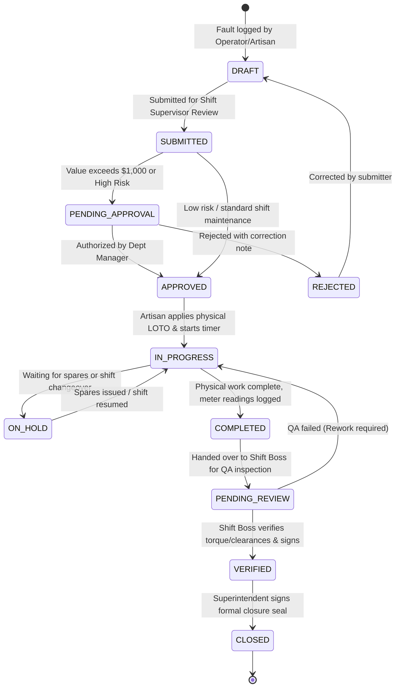

# Bikita Minerals DWRMS — Comprehensive Developer & Technical Guide

**Authoritative Engineering Specifications, Architecture, and Contribution Standards**  
*Enterprise Platform Architecture for Bikita Minerals Lithium Operations (Version 2.10.0)*

---

## Table of Contents

1. [Architectural Overview & Design Principles](#1-architectural-overview--design-principles)
2. [Technology Stack & System Requirements](#2-technology-stack--system-requirements)
3. [Backend Architecture & Technical Specifications](#3-backend-architecture--technical-specifications)
4. [Frontend Architecture & Component Specifications](#4-frontend-architecture--component-specifications)
5. [Role-Based Access Control (RBAC) & Security Layer](#5-role-based-access-control-rbac--security-layer)
6. [State Machine Engine & Operational Lifecycle](#6-state-machine-engine--operational-lifecycle)
7. [Offline-First Data Synchronization Architecture](#7-offline-first-data-synchronization-architecture)
8. [Local Development Environment Setup](#8-local-development-environment-setup)
9. [Automated Testing & Quality Assurance](#9-automated-testing--quality-assurance)
10. [Contribution Guidelines & Pull Request Standards](#10-contribution-guidelines--pull-request-standards)

---

## 1. Architectural Overview & Design Principles

Bikita Minerals DWRMS is built as a **server-first, offline-resilient, cross-platform enterprise system** designed to operate reliably in severe industrial environments (open-pit quarries, underground lithium processing tunnels, and distributed mine control rooms).

```mermaid
flowchart TB
    subgraph Client Layer
        DesktopApp["Windows Desktop App (Tauri / Next.js)"]
        TabletPWA["Rugged Tablet / Mobile (Offline PWA)"]
        WebPortal["Control Room Web Browser (LAN / WAN)"]
    end

    subgraph Edge Ingress & Security
        Nginx["Nginx Reverse Proxy (:80 / :443)"]
        RateLimit["Rate Limiter & Buffer Shield"]
        TLSTerm["TLS 1.2 / 1.3 Termination"]
    end

    subgraph Application Server (FastAPI Core)
        Router["API Gateway (/api/v1)"]
        AuthMiddleware["JWT & RBAC Capability Guard"]
        Idempotency["Idempotency Middleware (Replay Shield)"]
        
        subgraph Domain Modules
            JobsMod["Jobs & Maintenance Module"]
            FleetMod["Fleet & Heavy Equipment Module"]
            MaterialsMod["Materials & Stores Inventory"]
            SLAMod["SLA & Escalation Engine"]
            AuditMod["Cryptographic Audit Trail"]
            PlatformMod["Platform Telemetry & Lifecycle"]
        end
    end

    subgraph Async & Background Layer
        CeleryWorker["Celery Worker (Task Executor)"]
        CeleryBeat["Celery Beat (SLA & Health Cron)"]
        RedisBroker["Redis 7 (Message Broker & Cache)"]
    end

    subgraph Persistence Layer
        PostgresDB[("PostgreSQL 16 (Authoritative RDBMS)")]
        FileStorage[("Persistent Storage (/var/dwrms/storage)")]
        BackupEngine[("Encrypted Backup Snapshots (SHA-256)")]
    end

    DesktopApp --> Nginx
    TabletPWA --> Nginx
    WebPortal --> Nginx

    Nginx --> RateLimit --> TLSTerm --> Router
    Router --> AuthMiddleware --> Idempotency
    
    Idempotency --> JobsMod
    Idempotency --> FleetMod
    Idempotency --> MaterialsMod
    Idempotency --> SLAMod
    Idempotency --> AuditMod
    Idempotency --> PlatformMod

    JobsMod --> PostgresDB
    FleetMod --> PostgresDB
    MaterialsMod --> PostgresDB
    SLAMod --> PostgresDB
    AuditMod --> PostgresDB
    PlatformMod --> PostgresDB

    JobsMod --> FileStorage
    SLAMod --> CeleryWorker
    CeleryWorker --> RedisBroker
    CeleryBeat --> RedisBroker

    PlatformMod --> BackupEngine
```

### Core Design Principles

1. **Server-First Authority**: The central server maintains authoritative truth for asset allocations, inventory states, and compliance seals. Client clocks or drafts cannot override signed server states.
2. **Offline Durability**: Clients must function uninterrupted during network blackouts in underground shafts and quarry floors. Client mutations are queued with UUID v4 idempotency keys in IndexedDB and synchronized sequentially upon reconnection.
3. **Strict Capability-Based Authorization**: Users are assigned canonical roles, but the system checks granular *capabilities* (e.g., `job_card:approve`, `loto:isolate`), preventing privilege escalation.
4. **Idempotent Operations**: All mutating endpoints accept an `X-Idempotency-Key` header. Duplicate submissions caused by network retries never produce duplicate job cards or inventory deductions.
5. **Zero-Trust Auditability**: Every critical transition (LOTO isolation, QA verification endorsement, Superintendent closure seal) creates an immutable audit record containing user ID, role, timestamp, IP, and cryptographic hash.

---

## 2. Technology Stack & System Requirements

| Layer | Primary Technologies | Version | Justification |
| :--- | :--- | :--- | :--- |
| **Backend Runtime** | Python (AsyncIO) | 3.11 – 3.14 | High-throughput asynchronous I/O with native typing |
| **Backend Framework** | FastAPI + Starlette | >= 0.115.0 | OpenAPI generation, Pydantic validation, async performance |
| **ASGI Web Server** | Uvicorn (standard) | 0.34.0 | Low-latency HTTP/1.1 and WebSocket transport |
| **ORM / Database Layer** | SQLAlchemy 2.0 (Async) + asyncpg | >= 2.0.0 | Transactional async SQL, connection pooling, strict schemas |
| **Database Engine** | PostgreSQL / SQLite (test/fallback) | 16 / 3.40+ | ACID compliance, JSONB queries, row-level locking |
| **Schema Migrations** | Alembic | >= 1.13.0 | Versioned, rollback-capable schema migrations |
| **Task Queue & Cron** | Celery + Celery Beat + Redis | 5.4+ / 7.0+ | Non-blocking background SMS alerts, SLA sweeps |
| **Frontend Framework** | Next.js (App Router, Turbopack) | 16.3.2 | Server & client rendering, static route optimization |
| **Frontend UI Library** | React 19 + TypeScript 5 | 19.2.8 / 5+ | Component reactivity, strict type safety |
| **Styling & Design System**| Tailwind CSS v4 + Shadcn/UI | 4.3+ | Fluid responsive breakpoints, accessible UI primitives |
| **Desktop Application** | Tauri v2 + Rust | 2.11+ | Lightweight (~3 MB) cross-platform native wrapper |
| **Reverse Proxy / TLS** | Nginx | 1.22+ | SSL termination, rate limiting, gzip/brotli compression |
| **Process Supervision** | Systemd | Linux Core | Autonomous crash restart, watchdog timers, boot hooks |

---

## 3. Backend Architecture & Technical Specifications

The backend follows a **Modular Monolith** architecture with clean domain separation under `backend/app/`.

### Directory Structure

```text
backend/
├── app/
│   ├── api/v1/                 # Top-level API router registration
│   │   ├── events.py           # Real-time WebSocket / SSE telemetry
│   │   ├── export.py           # CSV / PDF export endpoints
│   │   ├── org.py              # Mine hierarchy & department tree
│   │   ├── platform.py         # Subsystem status, logs, backups, updates
│   │   ├── setup.py            # 8-stage installation wizard endpoints
│   │   ├── storage.py          # Document & image upload handler
│   │   └── system.py           # Host resource monitoring (CPU/RAM/Disk)
│   ├── cli/                    # Authoritative 'ops' CLI implementation
│   │   ├── backup.py           # Backup create/list/verify/prune commands
│   │   ├── configure.py        # Environment configuration inspector
│   │   ├── diagnostics.py      # System diagnostics generator
│   │   ├── health.py           # Deep latency probe
│   │   ├── main.py             # Click CLI group entry point
│   │   ├── restore.py          # Snapshot recovery runner
│   │   ├── setup.py            # Terminal-based setup wizard
│   │   ├── update.py           # 8-step platform upgrade pipeline
│   │   └── utils.py            # Terminal table formatting, docker detection
│   ├── core/                   # Cross-cutting enterprise services
│   │   ├── auth_provider.py    # Multi-tenant auth & password hashing
│   │   ├── config.py           # Pydantic BaseSettings environment loader
│   │   ├── database.py         # Async engine, sessionmaker, pool setup
│   │   ├── idempotency.py      # 48-hour idempotency replay middleware
│   │   ├── remote_connectivity.py # Mesh network & LAN status probes
│   │   ├── security.py         # JWT generation, decode & bcrypt routines
│   │   ├── storage.py          # Attachment storage manager & quota checker
│   │   └── version.py          # Authoritative version matrix tracker
│   ├── db/                     # Base declarative models
│   │   └── base.py             # SQLAlchemy Async Declarative Base
│   ├── modules/                # Domain-Driven Operational Modules
│   │   ├── approvals/          # Multi-tier cost & safety approval workflows
│   │   ├── assets/             # Mining plant & equipment asset registry
│   │   ├── audit/              # Cryptographic immutable audit logger
│   │   ├── contractors/        # Vendor personnel, safety inductions, hours
│   │   ├── dashboard/          # Aggregated KPIs, MTTR/MTBF, cost analytics
│   │   ├── fleet/              # Heavy vehicle dispatch & pre-start inspections
│   │   ├── iam/                # Users, credentials, roles, departments
│   │   ├── jobs/               # Job cards, labor timers, LOTO isolation
│   │   ├── materials/          # Spare parts catalog, inventory, issue slips
│   │   ├── notifications/      # Real-time notifications & dispatch alerts
│   │   ├── requests/           # Universal work requisition pipeline
│   │   ├── search/             # Multi-entity full-text global search
│   │   ├── sla/                # SLA calculation engine & escalation worker
│   │   ├── work/               # Shift Kanban & artisan task boards
│   │   └── workflow/           # Visual BPMN state machine definitions
│   ├── main.py                 # FastAPI application factory & middleware stack
│   └── worker.py               # Celery worker application & task definitions
├── alembic/                    # Database migration scripts
│   ├── env.py                  # Alembic async migration environment
│   └── versions/               # Versioned migration revision files
├── tests/                      # Automated test suite (168 tests)
│   ├── api/                    # HTTP endpoint integration tests
│   └── conftest.py             # Pytest fixtures, test database, client
├── requirements.txt            # Authoritative Python dependencies
└── pytest.ini                  # Pytest configuration & asyncio mode
```

### Key Subsystems & Implementation Details

#### 1. Async Database Session Lifecycle (`core/database.py`)
Database sessions are injected into FastAPI endpoints using standard dependency injection:
```python
from collections.abc import AsyncGenerator
from sqlalchemy.ext.asyncio import AsyncSession, async_sessionmaker, create_async_engine

engine = create_async_engine(
    settings.DATABASE_URL,
    pool_size=settings.DB_POOL_SIZE,
    max_overflow=settings.DB_MAX_OVERFLOW,
    pool_pre_ping=True,
)
AsyncSessionLocal = async_sessionmaker(bind=engine, class_=AsyncSession, expire_on_commit=False)

async def get_db() -> AsyncGenerator[AsyncSession, None]:
    async with AsyncSessionLocal() as session:
        try:
            yield session
            await session.commit()
        except Exception:
            await session.rollback()
            raise
        finally:
            await session.close()
```

#### 2. Idempotency Middleware (`core/idempotency.py`)
Protects against duplicate network submissions on all mutating requests (`POST`, `PUT`, `PATCH`, `DELETE`):
- Checks for the `X-Idempotency-Key` HTTP header.
- If present and cached within the 48-hour window, returns the cached response with `X-Idempotency-Replay: true`.
- **Safe error caching policy**: Only successful HTTP status codes (`< 300`) are cached. Client errors (`4xx`) and transient server errors (`5xx`) are never cached, allowing users to correct inputs and retry immediately.

---

## 4. Frontend Architecture & Component Specifications

The frontend is an enterprise Next.js application designed to compile both as a **Server-Rendered / Static Export Web App** and as a **Local Tauri Desktop Bundle**.

### Directory Structure

```text
frontend/
├── src/
│   ├── app/                    # Next.js App Router route hierarchy
│   │   ├── (auth)/login/       # Authentication portal & quick persona switcher
│   │   ├── admin/              # Administrative sub-consoles (org, audit, system)
│   │   ├── approvals/          # Departmental approval inbox & cost authorizations
│   │   ├── assets/             # Plant machinery registry & lifecycle views
│   │   ├── contractors/        # Contractor workforce & compliance tracker
│   │   ├── dashboard/          # Real-time operational dashboard & metrics
│   │   ├── fleet/              # Heavy vehicle fleet management & dispatch
│   │   ├── jobs/               # Job card registry, creation & detail screens
│   │   ├── materials/          # Spares catalog, inventory & issue tracking
│   │   ├── my-work/            # Artisan personal workbench & operator inspections
│   │   ├── requests/           # Universal work request submission pipeline
│   │   ├── setup/              # First-time browser-based setup wizard
│   │   ├── sla/                # SLA breach monitor & escalation rules
│   │   └── work/               # Operational shift Kanban & artisan task boards
│   ├── components/             # Reusable UI & domain components
│   │   ├── auth/               # Protect guard, login visualizer, role switches
│   │   ├── fleet/              # Machinery card, telemetry gauge, dispatch modal
│   │   ├── jobs/               # LOTO isolation banner, labor timer, signature pad
│   │   ├── my-work/            # Operator pre-start inspection checklist
│   │   ├── navigation/         # Responsive sidebar, mobile bottom navigation
│   │   └── ui/                 # Shadcn/UI primitive design components
│   ├── lib/                    # Client libraries & utilities
│   │   ├── api.ts              # Central API gateway client with auth & retry
│   │   ├── auth.ts             # Client authentication & token storage
│   │   ├── offlineStore.ts     # IndexedDB wrapper for offline mutations
│   │   ├── rbac.ts             # Client-side capability verification matrix
│   │   └── SyncManager.ts      # Background sync coordinator & retry engine
│   └── test/                   # Vitest configuration & mock setup
│       └── setup.ts            # Global localStorage, matchMedia, & DOM mocks
├── public/                     # Static icons, manifest.json, service workers
├── vitest.config.ts            # Vitest unit test configuration
├── package.json                # NPM scripts and dependency specifications
└── next.config.ts              # Next.js configuration (Turbopack, proxies)
```

---

## 5. Role-Based Access Control (RBAC) & Security Layer

DWRMS enforces an authoritative **8-Tier Operational Role Model**:

```text
               ┌──────────────────────────────┐
               │    System Administrator      │  (Full Platform Governance)
               └──────────────┬───────────────┘
                              │
               ┌──────────────┴───────────────┐
               │  Dept Manager / Supt.        │  (Financial & SLA Governance)
               └──────────────┬───────────────┘
                              │
               ┌──────────────┴───────────────┐
               │   Supervisor / Shift Boss    │  (Work Dispatch & QA Sign-off)
               └──────────────┬───────────────┘
                              │
         ┌────────────────────┼────────────────────┐
         │                    │                    │
┌────────┴────────┐  ┌────────┴────────┐  ┌────────┴────────┐
│  Artisan/Tech   │  │ Machine Operator│  │  Safety Officer │
│ (LOTO & Repair) │  │  (Inspection)   │  │  (HSE & Audits) │
└─────────────────┘  └─────────────────┘  └─────────────────┘
```

### The `<Protect>` Component (`components/auth/Protect.tsx`)

Wrap UI elements or entire pages to enforce capability requirements:

```tsx
import { Protect } from "@/components/auth/Protect";

// In-line element protection:
<Protect capability="job_card:approve">
  <Button onClick={handleApprove}>Approve Work Order</Button>
</Protect>

// Full page guard with 403 Access Restricted screen:
<Protect capability="system:configure" isPageGuard={true} moduleName="System Administration">
  <AdminControlPanel />
</Protect>
```

---

## 6. State Machine Engine & Operational Lifecycle

The **Job Card Lifecycle** enforces mandatory industrial safety gates:



### Mandatory Safety Gates:
1. **LOTO Isolation Lock**: A job card on an active machine cannot transition to `IN_PROGRESS` until the artisan confirms physical Lockout/Tagout isolation in the system.
2. **Double Endorsement**: Transition to `CLOSED` requires both the Supervisor's QA signature and the Department Superintendent's closure seal.

---

## 7. Offline-First Data Synchronization Architecture

To support underground operations with zero network connectivity:

1. **Client Storage (`IndexedDB: dwrms_offline_db`)**:
   - `sync_queue`: Stores pending HTTP mutation requests (`POST /api/v1/jobs`, etc.) with timestamps, idempotency keys, and payload snapshots.
   - `cached_lookups`: Stores machine registries, standard inspection templates, and artisan rosters locally.
2. **Background Sync Process (`SyncManager.ts`)**:
   - Detects network transitions via `window.addEventListener('online')` and periodic ping probes to `/api/v1/health`.
   - When online, drains the queue in strict chronological order.
   - Preserves idempotency: Replays the identical `X-Idempotency-Key` sent in the initial offline draft, ensuring network flapping never causes duplicate records.

---

## 8. Local Development Environment Setup

### Prerequisites

* **Node.js**: v20.x or v22.x LTS (tested up to v26.x)
* **Python**: v3.11, v3.12, v3.13, or v3.14
* **Git**: 2.30+
* **Docker & Docker Compose**: Optional for containerized workflow

### Quick Start (Bare-Metal Local Setup)

#### 1. Clone the Repository
```bash
git clone https://github.com/Aomine-c2c/jbc.git
cd jbc
```

#### 2. Configure Backend
```bash
cd backend
python3 -m venv .venv

# On Linux/macOS:
source .venv/bin/activate

# On Windows (PowerShell):
# .venv\Scripts\Activate.ps1

pip install --upgrade pip
pip install -r requirements.txt
```

Initialize local database and seed test accounts:
```bash
python init_db_all.py
python seed.py
```

Start backend development server:
```bash
uvicorn app.main:app --host 0.0.0.0 --port 8000 --reload
```

#### 3. Configure Frontend
Open a separate terminal:
```bash
cd frontend
npm ci
npm run dev
```

The application is now accessible at `http://localhost:3000`.

---

## 9. Automated Testing & Quality Assurance

All pull requests must pass 100% of automated tests before merging.

### Backend Test Suite (`pytest`)
The backend suite contains 168 unit, integration, and security tests covering RBAC, SLA calculations, idempotency, and the CLI suite:

```bash
# Run entire backend test suite:
backend/.venv/bin/pytest backend/tests

# Run specific domain test module:
backend/.venv/bin/pytest backend/tests/test_workflow_engine.py

# Run with verbose output and timing:
backend/.venv/bin/pytest backend/tests -v --durations=10
```

### Frontend Unit & Component Tests (`vitest`)
Frontend tests verify component security guards, RBAC resolution, and UI behavior:

```bash
cd frontend

# Run all unit tests:
npm test

# Run tests in watch mode during development:
npx vitest

# Run linter:
npm run lint

# Verify production Next.js build:
npm run build
```

### Playwright End-to-End Smoke Tests (`playwright`)
```bash
# Run end-to-end smoke tests:
npx playwright test

# Run tests with interactive UI viewer:
npx playwright test --ui
```

---

## 10. Contribution Guidelines & Pull Request Standards

### Branching Model
* `main`: Protected production branch. All commits must originate from reviewed PRs.
* `feat/<feature-name>`: New capabilities or functional enhancements.
* `fix/<bug-name>`: Bug fixes and issue remediations.
* `docs/<topic>`: Documentation enhancements.

### Commit Conventions
Follow the [Conventional Commits](https://www.conventionalcommits.org/) standard:
```text
feat(fleet): implement live GPS geofence alerts for haul trucks
fix(sla): prevent severity downgrade when completion deadline breached
docs(install): add Windows silent GPO installation parameters
test(auth): add multi-role capability test cases for HSE persona
```

### Pre-Submission Checklist
Before submitting a Pull Request, ensure all of the following commands execute with zero errors:
1. `npm run lint` in `frontend/` (0 errors)
2. `npm test` in `frontend/` (100% pass)
3. `npm run build` in `frontend/` (Clean build)
4. `pytest backend/tests` (168 / 168 passed)
5. `git grep -i "password_plaintext"` (No hardcoded credentials)
