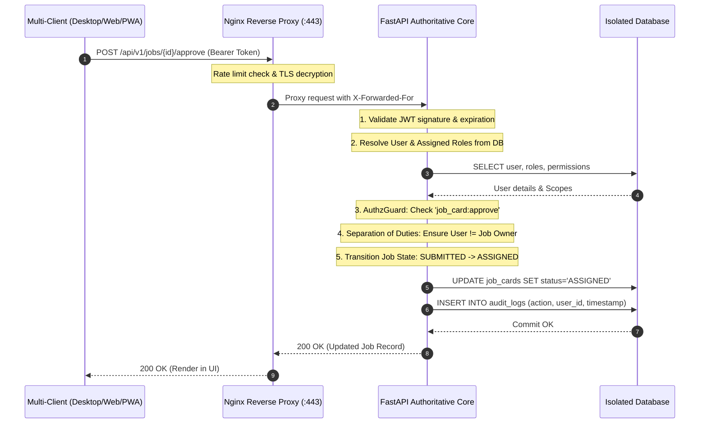

# Server-First Platform Architecture Specification (V1.8)

## 1. System Vision & Evolution Overview

The **Digital Work and Resource Management System (DWRMS)** has transitioned from a desktop-centric utility into a **Server-First Multi-Client Industrial Platform**.

Under Version 1.8, the **central Ubuntu Server is the single authoritative operational core**. All client endpoints—whether native desktop installations, modern web browsers, or mobile field devices—operate as thin presentation clients communicating over encrypted HTTPS/WSS with the central backend.

```
┌──────────────────────────────────────────────────────────────────────────┐
│                             CLIENT LAYER                                 │
│  ┌─────────────────────────┐  ┌──────────────────┐  ┌─────────────────┐  │
│  │  Tauri Desktop Client   │  │   Web Browser    │  │ Mobile Web/PWA  │  │
│  │ (Windows, Linux, macOS) │  │ (Desktop/Laptop) │  │  (Android, iOS) │  │
│  └───────────┬─────────────┘  └────────┬─────────┘  └────────┬────────┘  │
└──────────────┼─────────────────────────┼─────────────────────┼───────────┘
               │                         │                     │
               ▼                         ▼                     ▼
┌──────────────────────────────────────────────────────────────────────────┐
│                          CONNECTIVITY LAYER                              │
│   • Dynamic Server Config Modal (Host / IP Switcher)                     │
│   • Connection State Machine (ONLINE / CONNECTING / OFFLINE)             │
│   • IndexedDB Offline Queue & Draft Buffering (Idempotent Sync)          │
│   • Secure JWT Bearer Token Session Lifecycle                            │
└────────────────────────────────────────┬─────────────────────────────────┘
                                         │ HTTPS / WSS (:443)
                                         ▼
┌──────────────────────────────────────────────────────────────────────────┐
│                          APPLICATION LAYER                               │
│   • Nginx TLS 1.2/1.3 Reverse Proxy & Rate Limiting Gateway              │
│   • Next.js App Router UI Server (SSR / SSG / Static Asset Delivery)     │
└────────────────────────────────────────┬─────────────────────────────────┘
                                         │ Internal Private Network
                                         ▼
┌──────────────────────────────────────────────────────────────────────────┐
│                        BUSINESS LOGIC LAYER                              │
│   • FastAPI Authoritative REST API (/api/v1)                             │
│   • Scoped RBAC Engine & Separation of Duties (AuthzGuard)               │
│   • Workflow Engines (Job Cards, Reports, Requisitions, Approvals)       │
│   • Audit Logging & Security Middleware                                  │
│   • Celery & Async Background Workers (Escalations / SMS / Alerts)       │
└────────────────────────────────────────┬─────────────────────────────────┘
                                         │ Database Connections (Pool)
                                         ▼
┌──────────────────────────────────────────────────────────────────────────┐
│                            DATA LAYER                                    │
│   • Relational Persistence (MySQL / PostgreSQL) — Strictly Isolated      │
│   • Redis 7 In-Memory Cache & Message Broker                             │
│   • Alembic Database Versioning & Schema Migration Pipeline              │
└────────────────────────────────────────┬─────────────────────────────────┘
                                         │ Host OS Isolation
                                         ▼
┌──────────────────────────────────────────────────────────────────────────┐
│                       INFRASTRUCTURE LAYER                               │
│   • Ubuntu Server 22.04 / 24.04 LTS Core                                 │
│   • Docker Compose Production Multi-Container Stack                      │
│   • Systemd Watchdogs (`dwrms.service`, `dwrms-backup.timer`)            │
│   • UFW Hardened Firewall (Public: 80/443; Internal: 3306/5432/6379)     │
└──────────────────────────────────────────────────────────────────────────┘
```

---

## 2. 6-Layer Architectural Separation

### Layer 1: Client Layer
The platform natively supports three client modalities with a unified responsive interface:
* **Tauri Desktop Client**:
  - Target Platforms: Windows (`.msi`, `.exe`), Linux (`.deb`, `.AppImage`), macOS (`.dmg`, `.app`).
  - Architecture: Lightweight Rust runtime embedding Webview2 / WebKit with `@tauri-apps/plugin-store` for persistent configuration.
* **Web Browser Client**:
  - Target Platforms: Windows, Linux, macOS, ChromeOS running modern browsers (Google Chrome, Microsoft Edge, Mozilla Firefox, Apple Safari).
  - Zero local installation required; served directly by the authoritative server over HTTPS.
* **Mobile Web / PWA Client**:
  - Target Platforms: Android smartphones/tablets, iOS devices, ruggedized field tablets.
  - Installable via Web App Manifest (`manifest.json`) in standalone display mode with mobile viewport optimization and touch-optimized controls.

### Layer 2: Connectivity Layer
Ensures consistent, resilient communications between distributed clients and the central server:
* **Dynamic Server Configuration**: Clients can configure, test, and persist their backend target server URL dynamically (via Tauri store or browser local storage).
* **Live Connection State Machine**: `ConnectionProvider` monitors real-time connectivity status:
  - `ONLINE`: Active ping verification against `/api/v1/health`.
  - `CONNECTING`: Transient re-connection handshake.
  - `OFFLINE`: Local network disconnection detected.
  - `SERVER_UNAVAILABLE`: Network active but server heartbeat failing.
* **Offline Buffering & Conflict-Free Sync**: `offlineStore` (IndexedDB) stores uncommitted drafts and mutation requests when offline. Upon reconnection, `SyncManager` replays requests using idempotency headers (`X-Draft-Timestamp`, `X-Sync-ID`).
* **Session Lifecycle**: JWT Bearer token authentication with automated header attachment and 401 Unauthorized handling.

### Layer 3: Application Layer
Manages entry-point routing, static assets, and security termination:
* **Nginx Reverse Proxy**:
  - Terminates TLS 1.2/1.3 with strict modern ciphers.
  - Enforces API rate limiting (10 req/s per IP with burst capacity of 20).
  - Implements security headers: `Strict-Transport-Security`, `X-Frame-Options`, `X-Content-Type-Options`, `Referrer-Policy`.
  - Routes web requests to Next.js (port 3000) and API requests to FastAPI (port 8000).
* **Next.js Web Server**:
  - Server-Side Rendering (SSR) and Client-Side Routing for high-speed industrial dashboards and operations portals.

### Layer 4: Business Logic Layer
The authoritative engine where all business rules and permissions reside:
* **Authoritative RBAC Engine (`AuthzGuard`)**:
  - Central enforcement of role scopes: `GLOBAL`, `DEPARTMENT`, `ASSIGNED`, and `OWN`.
  - Enforces **Separation of Duties (SoD)**: Users cannot approve their own job cards or requisitions regardless of client-side overrides.
* **Workflow Engines**:
  - **Job Cards**: Strict state lifecycle (`DRAFT` → `SUBMITTED` → `ASSIGNED` → `IN_PROGRESS` → `COMPLETED` → `VERIFIED`).
  - **Job Reports**: Work log compilation, parts consumed, technician sign-offs.
  - **Requisitions & Approvals**: Multi-tier approval thresholds and department quotas.
  - **Fleet & Machines**: Telemetry logging, maintenance scheduling, operating hours tracking.
* **Audit Logging Middleware**: Intercepts every mutating request and writes structured audit logs (user ID, IP address, HTTP method, endpoint, status code, response time) to the persistent database.
* **Asynchronous Workers**: Celery / Asyncio event loop processing background notifications, SMS dispatch, and SLA escalation alerts.

### Layer 5: Data Layer
Enterprise relational and caching persistence:
* **Relational Database**: MySQL 8.0 or PostgreSQL 16 managed via asynchronous SQLAlchemy ORM.
* **Network Isolation**: The database has no exposed public ports and is accessible exclusively by the backend application container across the private Docker network.
* **Redis 7 Broker**: In-memory message queue for Celery workers and distributed lock coordination.
* **Alembic Database Versioning**: Programmatic schema migrations ensuring zero-downtime database upgrades.

### Layer 6: Infrastructure Layer
Production-grade deployment on Ubuntu Server:
* **Operating System**: Ubuntu Server 22.04 LTS or 24.04 LTS.
* **Containerization**: Docker & Docker Compose production stack (`docker-compose.prod.yml`).
* **Systemd Orchestration**: `dwrms.service` automatically restarts containers upon server reboot or failure.
* **Automated Disaster Recovery**: `dwrms-backup.timer` triggers daily backups at 02:00 CAT to `/var/dwrms/backups/`.
* **Firewall Hardening**: UFW allows only ports 22 (SSH), 80 (HTTP redirect), and 443 (HTTPS).

---

## 3. Authoritative Workflow & RBAC Security Model



### Core Security Invariants
1. **Frontend Non-Authoritative Rule**: Frontend role checks (e.g., `<Protect>`) exist purely for UI convenience. The backend unconditionally validates all permissions on every incoming API request.
2. **Database Isolation Rule**: No client may establish a direct database socket connection. All data access must pass through the authenticated API.
3. **Audit Immutability**: All state-changing actions generate tamper-evident audit records.
