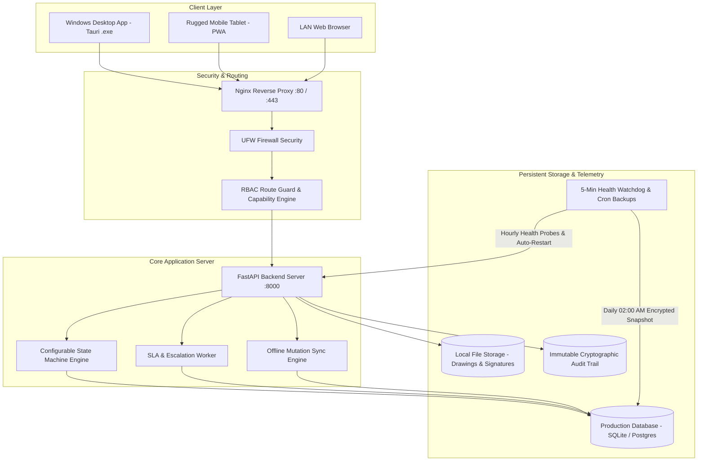
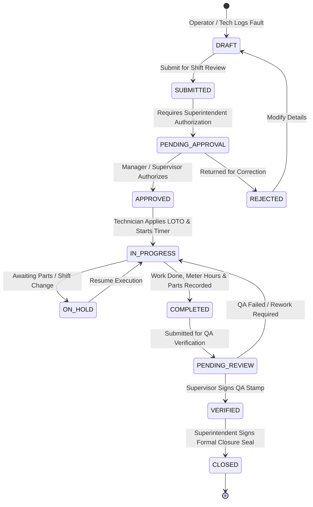

# Bikita Minerals DWRMS - Master System Documentation

**Digital Work Request & Maintenance System (DWRMS)**  
*Industrial-Grade Mining Operations, Heavy Fleet Management & Cross-Departmental Governance Core*

---

## 1. System Overview & Mission

Bikita Minerals DWRMS is a mission-critical, enterprise-grade maintenance, asset management, and operational workflow execution platform. Engineered specifically for demanding open-pit and underground mining environments, DWRMS centralizes equipment reliability, fault logging, multi-tier approvals, parts inventory, contractor compliance, and service level agreement (SLA) governance across all ten operational mining departments.

### Key Architectural Pillars

1. **Server-First Autonomous Core**: High-throughput FastAPI backend running on a dedicated Ubuntu Linux host with autonomous self-healing systemd services, automated health watchdogs, and 30-day encrypted backup rotation.
2. **Multi-Platform Local Applications**: Native Windows desktop applications (.exe / .msi via Tauri) for workshop/office PCs and installable Progressive Web Apps (PWA) with offline IndexedDB storage for rugged field tablets in open pits and underground shafts.
3. **Strict 6-Role RBAC Capability Enforcement**: Fine-grained access control with route guards and dynamic navigation filtering across Operators, Artisans, Shift Bosses, Superintendents, HSE Officers, and Administrators.
4. **Resilient Offline-First Synchronization**: Field workers can log faults, complete checklists, and capture touch signatures underground; transactions automatically queue and synchronize upon returning to LAN/WiFi coverage.

---

## 2. Enterprise Architecture

---

## 3. Operational Departments (10 Mining Sectors)

DWRMS structures assets, personnel, work orders, and inventory across ten core operational departments:

| ID | Department Code | Department Name | Scope & Responsibilities |
| :--- | :--- | :--- | :--- |
| `dept-mining` | **MIN** | **Mining Operations** | Open pit drilling, blasting, loading, hauling, and pit dewatering |
| `dept-mech` | **MECH** | **Mechanical Engineering** | Heavy mobile equipment (HME), fixed plant machinery, hydraulic overhauls |
| `dept-elec` | **ELEC** | **Electrical Engineering** | High-voltage substations, switchgear, electric motors, and instrumentation |
| `dept-plant` | **PROC** | **Processing Plant** | Crushing, milling, dense media separation (DMS), flotation, and filtration |
| `dept-civil` | **CIV** | **Civil & Infrastructure** | Haul roads, tailings dams, water supply, structural concrete, and buildings |
| `dept-survey` | **SURV** | **Survey & Geology** | Pit volumetric scanning, grade control, stockpiles, and geological exploration |
| `dept-safety` | **HSE** | **Safety & Environment** | OHS compliance, LOTO enforcement, incident audits, environmental monitoring |
| `dept-stores` | **SCM** | **Supply Chain & Stores** | Spares warehousing, stock replenishment, inventory control, and purchase requisitions |
| `dept-ict` | **ICT** | **ICT & Automation** | SCADA telemetry, mine communications, servers, networks, and software |
| `dept-admin` | **ADM** | **Administration & HR** | Workforce rosters, contractor vetting, regulatory compliance, and payroll liaison |

---

## 4. Role-Based Access Control (RBAC) Matrix

| Feature Module & Route | **Operator / Driver** | **Technician / Artisan** | **Supervisor / Shift Boss** | **Dept Manager / Superintendent** | **Safety Officer (HSE)** | **Administrator** |
| :--- | :---: | :---: | :---: | :---: | :---: | :---: |
| **Default Landing Route** | `/my-work` | `/my-work` | `/dashboard` | `/dashboard` | `/dashboard` | `/dashboard` |
| **My Work Hub** (`/my-work`) | ✅ Active | ✅ Active | ✅ Active | ✅ Active | ✅ Active | ✅ Active |
| **Ops Dashboard** (`/dashboard`) | ❌ Hidden (403) | ❌ Hidden (403) | ✅ Shift View | ✅ Dept View | ✅ Safety View | ✅ Full System |
| **Job Cards Registry** (`/jobs`) | ❌ Hidden (403) | ✅ Assigned Only | ✅ Full Shift | ✅ Full Dept | ✅ Safety Audit | ✅ Full Access |
| **Create Breakdown / Fault** (`/jobs/new`) | ✅ Basic Fault Log | ✅ Tech Report | ✅ Full Work Order | ✅ Full Work Order | ✅ Hazard Ticket | ✅ Full Access |
| **Job Execution & Live Timer** (`/jobs/[id]`) | ❌ Restricted | ✅ LOTO & Timer | ✅ Review & QA | ✅ Superintendent Seal | ✅ HSE Audit | ✅ Full Access |
| **Work Hub Kanban** (`/work`) | ❌ Hidden (403) | ❌ Hidden (403) | ✅ Active | ✅ Active | 👁️ Read-Only | ✅ Active |
| **Fleet & Machines** (`/fleet`) | 👁️ Assigned | 👁️ Assigned | ✅ Allocate | ✅ Fleet Overhaul | ✅ Safety Check | ✅ Full Access |
| **Fleet Requisitions** (`/fleet/requisitions/new`) | ✅ Request Machine | ✅ Request Machine | ✅ Approve & Dispatch | ✅ Manager Authorize | ❌ Hidden (403) | ✅ Full Access |
| **Fleet Calendar** (`/fleet/calendar`) | ✅ View Schedule | 👁️ Read-Only | ✅ Edit Schedule | ✅ Dept Schedule | 👁️ Read-Only | ✅ Full Access |
| **Asset Registry** (`/assets`) | ❌ Hidden (403) | ❌ Hidden (403) | ✅ Active | ✅ Lifecycle & Cost | 👁️ Compliance View | ✅ Full Access |
| **Materials & Stores** (`/materials`) | ❌ Hidden (403) | ✅ Request Spares | ✅ Approve Spares | ✅ Cost Governance | ❌ Hidden (403) | ✅ Full Access |
| **Contractors** (`/contractors`) | ❌ Hidden (403) | ❌ Hidden (403) | ✅ Log Hours | ✅ Vendor Contracts | ✅ HSE Induction | ✅ Full Access |
| **Approvals Inbox** (`/approvals`) | ❌ Hidden (403) | ❌ Hidden (403) | ✅ Shift Queue | ✅ Multi-Tier High Risk | ✅ Hot Work / LOTO | ✅ Override Access |
| **SLA & Escalations** (`/sla`) | ❌ Hidden (403) | ❌ Hidden (403) | ✅ Shift Alerts | ✅ SLA Governance | ✅ Safety Incidents | ✅ Full Access |
| **Org & Locations** (`/admin/org`, `/admin/locations`) | ❌ Hidden (403) | ❌ Hidden (403) | ❌ Hidden (403) | ✅ Dept Setup | ❌ Hidden (403) | ✅ Full Access |
| **Workflow Engine** (`/admin/workflows`) | ❌ Hidden (403) | ❌ Hidden (403) | ❌ Hidden (403) | ✅ Configure | ❌ Hidden (403) | ✅ Full Access |
| **Platform, System & Audit** (`/admin/*`) | ❌ Hidden (403) | ❌ Hidden (403) | ❌ Hidden (403) | ❌ Hidden (403) | 👁️ Audit Logs Only | ✅ Full Platform Access |

---

## 5. Job Card Lifecycle State Machine

---

## 6. Offline Storage & Synchronization Architecture

1. **Client IndexedDB Store (`dwrms_offline_db`)**:
   - `sync_queue`: Holds pending mutating HTTP requests (`POST`, `PUT`, `PATCH`, `DELETE`) with cryptographic timestamps and UUID headers.
   - `drafts`: Stores work in progress (inspection checklists, fault photos, touch signatures).
2. **Conflict Resolution Strategy**:
   - Server-Authoritative: The server evaluates version timestamps and cryptographic hashes.
   - LOTO Lockouts: If an asset is locked out on the server, local execution updates take safety precedence.
3. **Background Sync Trigger**:
   - Web / PWA: Listens to window `online` events and Service Worker `sync` events.
   - Desktop App: Polls LAN heartbeat every 10 seconds; flushes queued requests sequentially with exponential backoff on transient network faults.

---

## 7. Autonomous Server Self-Healing Infrastructure

- **Host Operating System**: Ubuntu 22.04 / 24.04 LTS Server.
- **Service Management**: Systemd unit (`dwrms.service`) with `Restart=always` and `RestartSec=5s`.
- **Health Watchdog Daemon**: Continuous 5-minute health watchdog (`dwrms-watchdog.timer`) probing `/api/v1/health`. Automatically restarts workers if unresponsive.
- **Automated Backup Engine**: Daily at 02:00 CAT via systemd timer (`dwrms-backup.timer`). Creates atomic database dumps and asset gzip archives with SHA-256 integrity checks and 30-day automatic disk rotation.
- **Continuous Update Engine**: 60-second systemd timer (`dwrms-autoupdate.timer`) invoking `ops update apply` for zero-touch maintenance.
- **Network & Firewall**: Nginx reverse proxy with TLS 1.2/1.3 and gzip compression; UFW firewall strictly isolating ports.

---

## 8. Authoritative Operational & Technical Manuals Index

| Manual | Path | Description & Target Audience |
| :--- | :--- | :--- |
| **Comprehensive Developer Guide** | [`docs/DEVELOPER_GUIDE.md`](DEVELOPER_GUIDE.md) | Technical specs, domain modules, state machine engine, RBAC, frontend architecture, and contribution standards. |
| **Cross-Platform Setup & Dependency Guide** | [`docs/CROSS_PLATFORM_SETUP.md`](CROSS_PLATFORM_SETUP.md) | Complete installation and dependency manual for Linux (Ubuntu/Debian) and Windows (NSIS, MSI, PowerShell). |
| **Installation & Dependency Management** | [`docs/INSTALLATION_AND_DEPENDENCIES.md`](INSTALLATION_AND_DEPENDENCIES.md) | Detailed 7-stage automated `install.sh` pipeline, runtime packages, storage layout, environment variables, and TLS. |
| **Version Upgrade & Migration Guide** | [`docs/UPGRADE_AND_MIGRATION_GUIDE.md`](UPGRADE_AND_MIGRATION_GUIDE.md) | The 8-stage `ops update apply` pipeline, Alembic schema migrations, and 1-command emergency rollback runbooks. |
| **Interface Modes & Operations Manual** | [`docs/INTERFACE_MODES.md`](INTERFACE_MODES.md) | Comprehensive operational manual for Desktop GUI, Rugged Tablet PWA (offline sync), Web Portal, and `ops` CLI suite. |
| **Platform Administration CLI (`ops`) Reference** | [`docs/OPS_CLI_REFERENCE.md`](OPS_CLI_REFERENCE.md) | Global flags, subcommands, and operational syntax for `/usr/local/bin/ops`. |
| **Disaster Recovery & Backup Runbook** | [`docs/DISASTER_RECOVERY.md`](DISASTER_RECOVERY.md) | Backup procedures, SHA-256 verification, automated rotation, and bare-metal restoration. |
| **Ubuntu Server Deployment Guide** | [`docs/UBUNTU_SERVER_DEPLOYMENT.md`](UBUNTU_SERVER_DEPLOYMENT.md) | Host OS preparation, container orchestration, and network hardening for Ubuntu LTS. |
| **API & Operations Manual** | [`docs/API_OPERATIONS_MANUAL.md`](API_OPERATIONS_MANUAL.md) | REST API endpoints, schemas, parameters, and authentication scopes. |
| **Client Applications Guide** | [`deploy/CLIENT_SETUP_GUIDE.md`](../deploy/CLIENT_SETUP_GUIDE.md) | Multi-device installation manual for Windows Desktop Apps (.msi / Tauri) and Rugged Tablet PWAs. |
| **6-Role Demo Walkthrough** | [`docs/ROLE_DEMO_WALKTHROUGH.md`](ROLE_DEMO_WALKTHROUGH.md) | Step-by-step interactive scenario centered on CAT 777D Haul Truck breakdown and repair. |
